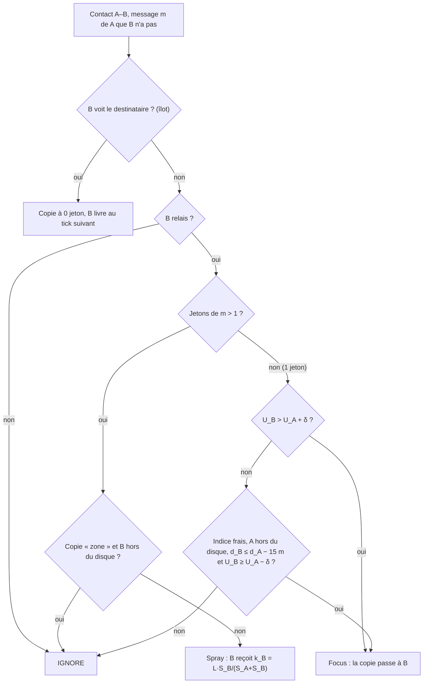

# TIDE-G — TIDE guidé par la dernière position du destinataire

TIDE-G est TIDE auquel on ajoute un indice de position : la dernière position connue du destinataire, que lui seul a communiquée, chiffrée, à son correspondant. Quand le message porte un indice récent, les relais utilisent leur propre GPS pour rapprocher la copie de cette position. Sans indice, TIDE-G se comporte exactement comme TIDE.

TIDE-G entre dans la comparaison comme candidat supplémentaire. Le comparer à TIDE mesure ce que la localisation apporte réellement, et ce qu'elle coûte en batterie.

---

## 1. Cadrage

| Décision | Choix retenu |
| --- | --- |
| Rôle | Candidat en plus, comparé à TIDE sur les mêmes graines |
| Source de position | GPS du téléphone (bruité, σ = 5 m dans le simulateur), ramené à un repère local du festival en mètres |
| Qui révèle la position du destinataire | Le destinataire seul : sa position voyage chiffrée dans les messages qu'il envoie, et seul son correspondant s'en sert comme indice |
| Ce que les relais n'ont pas le droit de faire | Enregistrer ou diffuser l'endroit où ils ont croisé quelqu'un |
| Trafic | Unicast uniquement |
| Latence | ≤ 2 min parfait, 2–5 min très bien, 5–10 min acceptable, au-delà le message arrive marqué « en retard » |
| Cibles d'implémentation | Simulateur `festival_ble_sim` (Python) et appli KMM |

Le simulateur fournit déjà exactement ce modèle de position (PR `feat/gps-position`) :

- `node.gps_position()` donne une lecture GPS bruitée ;
- `message.src_position` contient la position de la source à la création ;
- à la livraison, le moteur la range dans `destination.known_positions[src]` ;
- `message.dst_position` / `dst_position_time` contiennent la dernière position du destinataire connue de la source. C'est l'indice de TIDE-G.

---

## 2. Principe en une page

1. **Léa écrit à Paul.** Sa position GPS part dans le message, chiffrée de bout en bout. Seul Paul la lit, et il la garde (« Léa était là à 21:03 »).
2. **Paul répond à Léa.** Si la position de Léa date de moins de 15 min, l'appli de Paul la met en indice dans l'en-tête de routage. L'indice est arrondi à une case de 25 m et accompagné de son âge.
3. **Les relais rapprochent le message de la case.** Ils comparent leur propre position GPS à l'indice. La copie unique passe à un voisin nettement plus proche, et les jetons se partagent en faveur des voisins proches.
4. **Arrivée dans la zone.** Le disque autour de l'indice grossit avec l'âge de l'indice. Quand la copie y entre, elle reçoit quelques jetons de recherche, qui ne circulent qu'à l'intérieur du disque. Les îlots de TIDE font le dernier saut.
5. **Pas d'indice, ou indice trop vieux** : TIDE pur.

Conséquence directe du choix « destinataire seul » : **un indice n'existe que si le destinataire a écrit récemment à l'émetteur**. TIDE-G aide donc surtout les conversations (réponses, échanges rapides), pas les premiers messages. C'est pourquoi la section 4.4 ajoute un modèle de réponses au simulateur : sans lui, presque aucun message n'a d'indice et TIDE-G ne peut rien montrer.

---

## 3. Spécification

### 3.1 Indice et disque d'incertitude

Un message porte un indice utilisable si `dst_position` est connu et si son âge `h = now − dst_position_time` est d'au plus `H_max` = 15 min.

```
position de l'indice  = centre de la case de 25 m contenant dst_position
rayon d'incertitude   r(h) = r0 + v · h          (r0 = 30 m, v = 0,3 m/s)
confiance             κ(h) = exp(−h / τ_h)       (τ_h = 10 min)
```

`v = 0,3 m/s` est calibré sur la mobilité `poi` du simulateur (400 festivaliers, 1 h, échauffement de 20 min exclu). Le rayon r(h) couvre environ 80 % des déplacements réels :

| Âge de l'indice | Déplacement médian | 75e centile | 90e centile | r(h) |
| --- | --- | --- | --- | --- |
| 3 min | 0 m | 55 m | 108 m | 84 m |
| 5 min | 0 m | 91 m | 165 m | 120 m |
| 10 min | 28 m | 168 m | 268 m | 210 m |
| 15 min | 81 m | 231 m | 320 m | 300 m |

La médiane nulle vient des pauses de 5 à 45 min (concerts, files d'attente) : la plupart des gens n'ont pas bougé. C'est ce qui rend un indice de quelques minutes très informatif.

### 3.2 Positions des relais

- Un nœud prend un fix GPS toutes les `gps_period` = 30 s **seulement s'il est relais élu, ou s'il porte un message à indice**. Les autres ne paient rien.
- Un fix de plus de 60 s ne compte pas. Un nœud sans fix frais ne participe pas aux règles géographiques : pour ce couple de nœuds, on applique TIDE.
- Les bornes ont une position exacte et gratuite.

### 3.3 Score géographique et utilité combinée

Pour un nœud X à la distance d_X de l'indice :

```
g_X  = 1 / (1 + max(0, d_X − r(h)) / λ)          λ = 100 m
S_X  = min(1, max( U_X , e_X · κ(h) · g_X ))
```

- U_X est l'utilité TIDE : PRoPHET, fraîcheur de la dernière rencontre et facteur énergie e_X.
- g_X vaut 1 dans le disque, puis décroît avec la distance au disque.
- Le `max` garantit que **TIDE-G ne classe jamais un nœud plus bas que TIDE**. Avoir croisé le destinataire il y a 1 min reste le meilleur signal, et l'indice ne fait que relever les nœuds bien placés.

### 3.4 Décision par message

Seules trois règles de TIDE changent. Tout le reste est identique : îlots, élection des relais, quota de synchros, réinjection, ACK et éviction.

| Étape TIDE | Ce que TIDE-G change |
| --- | --- |
| Partage des jetons | k_B = L · S_B / (S_A + S_B) : utilité **combinée** au lieu de U |
| Spray | Une copie marquée « zone » ne part que vers un relais situé dans le disque |
| Focus (copie unique) | En plus de U_B > U_A + δ : passage si B est **au moins 15 m plus près** de l'indice, si A est hors du disque, et si U_B ≥ U_A − δ |
| Avant routage | Recherche locale (3.5) et rafraîchissement de l'indice par la source (3.6) |



La condition U_B ≥ U_A − δ interdit les allers-retours. Si la règle géographique a passé la copie de A à B, la règle d'utilité de TIDE ne peut pas la lui rendre, car il faudrait U_A > U_B + δ. Les 15 m de progrès minimum, plus de deux fois le bruit GPS sur une différence de distances, évitent les oscillations dues au bruit.

### 3.5 Recherche locale

Quand une copie à **1 jeton** se trouve chez un nœud situé dans le disque, elle passe une seule fois à `zone_tokens` = 3 jetons et reçoit le marqueur `zone`. Ses descendants héritent du marqueur et ne sont distribués qu'à des relais situés dans le disque.

- But : le destinataire peut être n'importe où dans un disque de 80 à 300 m de rayon. Quelques copies locales couvrent la zone bien mieux qu'une copie unique.
- Borne : chaque copie focus ne peut être boostée qu'une fois. Le surcoût est donc au plus de (zone_tokens − 1) copies par copie focus.

### 3.6 Rafraîchissement par la source

Quand la source repasse sur sa propre copie (copie fantôme, réinjections), elle remplace l'indice si elle a reçu entre-temps un message plus récent du destinataire. Cela reste conforme au choix « destinataire seul » : c'est toujours le destinataire qui a fourni sa position.

### 3.7 Énergie

Le GPS est le coût principal de TIDE-G.

- Seuls les relais élus et les porteurs d'un message à indice prennent des fixes. En foule dense, l'élection limite les relais à environ 7 % des téléphones. En zone clairsemée, tout le monde est relais.
- Le simulateur facture `gps_current_ma × gps_period / 3600` mAh par fix. La valeur de départ de 10 mA est **une hypothèse à mesurer** sur appareils, comme les 2 mA de fond déjà dans `EnergyConfig`.
- Variante d'ablation `gps_for_relays=False` : seuls les porteurs de messages à indice prennent des fixes. C'est moins cher, mais les voisins ont rarement un fix frais.

### 3.8 Vie privée

| Donnée | Qui la voit | Forme |
| --- | --- | --- |
| Position de l'émetteur | Le destinataire seul | Chiffrée de bout en bout dans la charge utile |
| Indice (position du destinataire) | Les relais qui portent ce message | En clair dans l'en-tête, arrondi à 25 m, seulement si < 15 min |
| Position d'un relais | Son voisin direct pendant la synchro | Déjà à moins de 30 m, rien de plus n'est révélé |
| Où un relais a croisé quelqu'un | Personne | Jamais enregistré ni transmis |

- La fuite résiduelle est réelle : un relais apprend que tel pseudonyme était dans telle case de 25 m il y a quelques minutes. Elle est inhérente au routage géographique et limitée par l'arrondi, la durée de vie courte et le pseudonyme propre au festival.
- Il faut un réglage « Partager ma position avec les personnes à qui j'écris ». Désactivé, aucune position ne part dans les messages, et les messages vers cette personne sont routés comme dans TIDE.
- La localisation est une donnée personnelle. Base légale et information des utilisateurs sont à valider avec le festival (je ne suis pas juriste).

### 3.9 Paramètres

| Paramètre | Nom dans le code | Valeur de départ |
| --- | --- | --- |
| Âge maximal d'un indice | `hint_max_age_s` | 900 s |
| Décroissance de la confiance | `hint_tau_s` | 600 s |
| Taille de case de l'indice | `hint_cell_m` | 25 m |
| Rayon initial | `hint_r0_m` | 30 m |
| Vitesse de dérive | `drift_mps` | 0,3 m/s |
| Échelle du score géographique | `geo_lambda_m` | 100 m |
| Progrès minimal du focus | `min_progress_m` | 15 m |
| Jetons de recherche locale | `zone_tokens` | 3 |
| Période des fixes GPS | `gps_period_s` | 30 s |
| Âge maximal d'un fix | `fix_max_age_s` | 60 s |
| Courant GPS moyen | `gps_current_ma` | 10 mA (à mesurer) |
| Interrupteurs d'ablation | `geo_focus`, `geo_tokens`, `zone_search`, `refresh_hint`, `gps_for_relays` | tous `True` |
| Paramètres TIDE | identiques à `TideRouting` | inchangés |

---

## 4. Implémentation dans le simulateur

Ce code a été testé sur une copie du dépôt : les 285 tests existants passent toujours, plus 9 tests TIDE-G, et TIDE donne exactement les mêmes résultats avant et après le refactor.

### 4.1 Ordre des changements

1. `routing/tide.py` : quatre points d'extension, sans changer le comportement (4.2).
2. `routing/tide_g.py` : le routeur, une sous-classe de `TideRouting` (4.3).
3. Modèle de réponses : `TrafficConfig`, `network.py`, `traffic.py`, `simulation.py` (4.4).
4. Enregistrement dans `main.py` et `scripts/compare_algorithms.py` (4.5).
5. Tests dans `tests/test_routing_tide_g.py` (4.6).
6. Doc courte dans `docs/algorithmes/tide_g.md`, sur le modèle des autres algos, et ligne dans le README.

### 4.2 Points d'extension dans `tide.py`

Dans `decide`, juste après la réinjection :

```python
        if self._reinjection and holder.id == message.src_id:
            self._maybe_reinject(message, now)
        self._before_route(message, holder, now)
```

La fin de `decide` délègue le spray et le focus :

```python
        tokens = state[_TOKENS]
        if tokens > 1:
            if not self._spray_ok(message, holder, contact, now):
                return RoutingDecision.IGNORE
            state[_FORWARD_REASON] = "spray"
            return RoutingDecision.FORWARD
        if tokens == 1 and self._focus_ok(message, holder, contact, now):
            state[_FORWARD_REASON] = "focus"
            return RoutingDecision.FORWARD
        return RoutingDecision.IGNORE

    # --- extension points (TIDE-G overrides them) -------------------------

    def _before_route(self, message: Message, holder: "BaseNode", now: float) -> None:
        pass

    def _spray_ok(self, message: Message, holder: "BaseNode", contact: "BaseNode", now: float) -> bool:
        return True

    def _focus_ok(self, message: Message, holder: "BaseNode", contact: "BaseNode", now: float) -> bool:
        u_holder = self._utility(holder, message.dst_id, now)
        u_contact = self._utility(contact, message.dst_id, now)
        return u_contact > u_holder + self._delta

    def _token_share(self, message: Message, holder: "BaseNode", contact: "BaseNode", now: float) -> float:
        if not self._weighted_tokens:
            return 0.5
        u_a = self._utility(holder, message.dst_id, now)
        u_b = self._utility(contact, message.dst_id, now)
        return 0.5 if u_a + u_b == 0.0 else u_b / (u_a + u_b)
```

Dans `on_forward`, le calcul de `share` (le bloc `if self._weighted_tokens: … else: share = 0.5`) devient :

```python
        share = self._token_share(message, holder, contact, self._now)
```

### 4.3 `routing/tide_g.py`

```python
from __future__ import annotations
import math
from typing import Dict, List, NamedTuple, Optional, TYPE_CHECKING
from ..models import Message, Position
from .tide import TideRouting, _TOKENS

if TYPE_CHECKING:
    from ..nodes import BaseNode

_ZONE = "zone"


class _Hint(NamedTuple):
    position: Position
    age_s: float
    radius_m: float
    confidence: float


class TideGRouting(TideRouting):
    # TIDE-G: TIDE + the destination's own last position as a routing hint.
    # The hint is only what the engine puts in message.dst_position (the
    # destination's GPS from its last message delivered to the source):
    # relays never record where they met anyone. Relays and holders of a
    # hinted message take a GPS fix every gps_period_s; a node without a
    # fresh fix takes no part in the geographic rules. No usable hint, or
    # no fixes on both sides, reduces exactly to TIDE.
    def __init__(
        self,
        hint_max_age_s: float = 900.0,
        hint_tau_s: float = 600.0,
        hint_cell_m: float = 25.0,
        hint_r0_m: float = 30.0,
        drift_mps: float = 0.3,
        geo_lambda_m: float = 100.0,
        min_progress_m: float = 15.0,
        zone_tokens: int = 3,
        gps_period_s: float = 30.0,
        fix_max_age_s: float = 60.0,
        gps_current_ma: float = 10.0,
        gps_for_relays: bool = True,
        geo_focus: bool = True,
        geo_tokens: bool = True,
        zone_search: bool = True,
        refresh_hint: bool = True,
        **tide_kwargs,
    ) -> None:
        super().__init__(**tide_kwargs)
        if hint_max_age_s <= 0 or hint_tau_s <= 0 or geo_lambda_m <= 0 or gps_period_s <= 0:
            raise ValueError("hint_max_age_s, hint_tau_s, geo_lambda_m and gps_period_s must be > 0")
        if zone_tokens < 1:
            raise ValueError("zone_tokens must be >= 1")
        self._hint_max_age_s = hint_max_age_s
        self._hint_tau_s = hint_tau_s
        self._hint_cell_m = hint_cell_m
        self._hint_r0_m = hint_r0_m
        self._drift_mps = drift_mps
        self._geo_lambda_m = geo_lambda_m
        self._min_progress_m = min_progress_m
        self._zone_tokens = zone_tokens
        self._gps_period_s = gps_period_s
        self._fix_max_age_s = fix_max_age_s
        self._gps_current_ma = gps_current_ma
        self._gps_for_relays = gps_for_relays
        self._geo_focus = geo_focus
        self._geo_tokens = geo_tokens
        self._zone_search = zone_search
        self._refresh_hint = refresh_hint
        self._fixes: Dict[int, tuple] = {}
        self._next_gps_round = 0.0
        self.hint_stats = {"routed": 0, "hinted": 0, "delivered": 0, "delivered_hinted": 0, "gps_fixes": 0}
        self._seen: set = set()

    # --- GPS fixes --------------------------------------------------------

    def on_tick(self, now: float, neighbors_by_node: Dict[int, List["BaseNode"]]) -> None:
        super().on_tick(now, neighbors_by_node)
        if now < self._next_gps_round:
            return
        self._next_gps_round = now + self._gps_period_s
        fix_mah = self._gps_current_ma * self._gps_period_s / 3600.0
        for nid in neighbors_by_node:
            node = self._nodes.get(nid)
            if node is None or node.is_beacon:
                continue
            if self._needs_gps(node, now):
                self._fixes[nid] = (node.gps_position(), now)
                node.consume_energy(fix_mah)
                self.hint_stats["gps_fixes"] += 1

    def _needs_gps(self, node: "BaseNode", now: float) -> bool:
        if self._gps_for_relays and self._acts_as_relay(node, now):
            return True
        return any(self._hint(m, now) is not None for m in node.buffer.values())

    def _fix(self, node: "BaseNode", now: float) -> Optional[Position]:
        if node.is_beacon:
            return node.position
        fix = self._fixes.get(node.id)
        if fix is None or now - fix[1] > self._fix_max_age_s:
            return None
        return fix[0]

    # --- hint -------------------------------------------------------------

    def _hint(self, message: Message, now: float) -> Optional[_Hint]:
        if message.dst_position is None or message.dst_position_time is None:
            return None
        age = now - message.dst_position_time
        if age > self._hint_max_age_s:
            return None
        pos = message.dst_position
        if self._hint_cell_m > 0:
            c = self._hint_cell_m
            pos = Position((math.floor(pos.x / c) + 0.5) * c, (math.floor(pos.y / c) + 0.5) * c)
        return _Hint(pos, age, self._hint_r0_m + self._drift_mps * age, math.exp(-age / self._hint_tau_s))

    def _distance(self, node: "BaseNode", hint: _Hint, now: float) -> Optional[float]:
        pos = self._fix(node, now)
        return None if pos is None else pos.distance_to(hint.position)

    def _geo(self, d: float, hint: _Hint) -> float:
        return 1.0 / (1.0 + max(0.0, d - hint.radius_m) / self._geo_lambda_m)

    def _score(self, node: "BaseNode", message: Message, now: float) -> float:
        u = self._utility(node, message.dst_id, now)
        hint = self._hint(message, now)
        if hint is None:
            return u
        d = self._distance(node, hint, now)
        if d is None:
            return u
        return min(1.0, max(u, self._energy(node) * hint.confidence * self._geo(d, hint)))

    # --- TIDE extension points --------------------------------------------

    def _before_route(self, message: Message, holder: "BaseNode", now: float) -> None:
        state = message.routing_state
        if holder.id == message.src_id and message.msg_id not in self._seen:
            self._seen.add(message.msg_id)
            self.hint_stats["routed"] += 1
            if self._hint(message, now) is not None:
                self.hint_stats["hinted"] += 1
        if self._refresh_hint and holder.id == message.src_id:
            known = holder.known_positions.get(message.dst_id)
            if known is not None and (message.dst_position_time is None or known[1] > message.dst_position_time):
                message.dst_position, message.dst_position_time = known
        if not self._zone_search or state.get(_ZONE) or state.get(_TOKENS) != 1:
            return
        hint = self._hint(message, now)
        if hint is None:
            return
        d = self._distance(holder, hint, now)
        if d is not None and d <= hint.radius_m:
            state[_TOKENS] = self._zone_tokens
            state[_ZONE] = True

    def _spray_ok(self, message: Message, holder: "BaseNode", contact: "BaseNode", now: float) -> bool:
        if not message.routing_state.get(_ZONE):
            return True
        hint = self._hint(message, now)
        if hint is None:
            return True
        d = self._distance(contact, hint, now)
        return d is not None and d <= hint.radius_m

    def _focus_ok(self, message: Message, holder: "BaseNode", contact: "BaseNode", now: float) -> bool:
        if super()._focus_ok(message, holder, contact, now):
            return True
        if not self._geo_focus:
            return False
        hint = self._hint(message, now)
        if hint is None:
            return False
        d_a = self._distance(holder, hint, now)
        d_b = self._distance(contact, hint, now)
        if d_a is None or d_b is None or d_a <= hint.radius_m:
            return False
        # Never hand the copy to a node TIDE's own rule would hand it back from.
        u_a = self._utility(holder, message.dst_id, now)
        u_b = self._utility(contact, message.dst_id, now)
        return d_b <= d_a - self._min_progress_m and u_b >= u_a - self._delta

    def _token_share(self, message: Message, holder: "BaseNode", contact: "BaseNode", now: float) -> float:
        if not self._geo_tokens:
            return super()._token_share(message, holder, contact, now)
        if not self._weighted_tokens:
            return 0.5
        s_a = self._score(holder, message, now)
        s_b = self._score(contact, message, now)
        return 0.5 if s_a + s_b == 0.0 else s_b / (s_a + s_b)

    def on_delivered(self, message: Message, holder: "BaseNode") -> None:
        if message.msg_id not in self._delivered_ids:
            self.hint_stats["delivered"] += 1
            if self._hint(message, message.creation_time) is not None:
                self.hint_stats["delivered_hinted"] += 1
        super().on_delivered(message, holder)
```

Points à respecter, conformes à `CLAUDE.md` :

- Les fixes sont pris dans `on_tick` une fois toutes les 30 s et gardés en cache. Tous les nœuds voient donc la même position pendant un tick, et le coût reste borné : le parcours des buffers n'a lieu qu'une fois toutes les 30 s.
- La source modifie l'indice de **sa propre** copie seulement. Les copies déjà transmises sont des objets indépendants (`dataclasses.replace`), donc rien n'est partagé.
- Le coût GPS passe par `node.consume_energy`. Il apparaît donc dans `total_energy_consumed_mah` et dans `dead_node_count`, comme le reste.
- `hint_stats` donne la couverture d'indice : messages routés avec ou sans indice, et livrés avec ou sans indice. Il suffit de le lire après `run_simulation`.

### 4.4 Modèle de réponses (prérequis)

Sans réponses, un indice n'existe que si le destinataire a, par hasard, écrit à l'émetteur dans les 15 dernières minutes. Avec le trafic par défaut (0 à 4 messages/h vers un ami au hasard du groupe), c'est rare. Le modèle ajouté est désactivé par défaut, donc les autres algos ne changent pas.

`config.py`, dans `TrafficConfig` :

```python
    # Conversations: probability that a delivered message gets a reply from
    # its destination, after a delay drawn from reply_delay_range_s. Replies
    # can themselves be replied to. 0.0 = no replies (previous behavior).
    reply_probability: float = 0.0
    reply_delay_range_s: Tuple[float, float] = (20.0, 180.0)
```

et dans `SimulationConfig.__post_init__` :

```python
        if not 0.0 <= self.traffic.reply_probability < 1.0:
            raise ValueError("reply_probability must be in [0, 1)")
```

`network.py` : un paramètre `on_delivery: Optional[Callable[[Message, BaseNode, float], None]] = None` est ajouté à `process_node_contacts` et à `network_engine`, qui le transmet. Il est appelé juste après `routing_algorithm.on_delivered(copy, sender)` :

```python
                if on_delivery is not None:
                    on_delivery(copy, contact, now)
```

`traffic.py` :

```python
def reply_process(
    env,
    node: MobileNode,
    dst_id: int,
    delay_s: float,
    nodes: Dict[int, MobileNode],
    config: TrafficConfig,
    metrics: MetricsCollector,
    id_generator: Iterator[int],
    rng: random.Random,
):
    yield env.timeout(delay_s)
    target = nodes.get(dst_id)
    if not node.is_active or target is None or not target.is_active:
        return
    message = generate_message(
        next(id_generator), env.now, node.id, dst_id, config, rng,
        src_position=node.gps_position(),
        dst_known=node.known_positions.get(dst_id),
    )
    node.store_message(message)
    metrics.record_creation(message)
```

`simulation.py`, juste après la création de `network_rng`. La graine des réponses n'est tirée que si les réponses sont actives, ce qui garde les runs existants identiques :

```python
    on_delivery = None
    if config.traffic.reply_probability > 0:
        reply_rng = random.Random(network_rng.randrange(1 << 30))

        def on_delivery(message, receiver, now):
            if receiver.id not in mobile_nodes or reply_rng.random() >= config.traffic.reply_probability:
                return
            env.process(reply_process(
                env, mobile_nodes[receiver.id], message.src_id, reply_rng.uniform(*config.traffic.reply_delay_range_s),
                mobile_nodes, config.traffic, metrics, msg_id_counter, reply_rng,
            ))
```

puis `on_delivery=on_delivery` est passé à `network_engine(...)`.

La réponse reprend automatiquement la position que la source vient de transmettre (`known_positions`, renseigné à la livraison). Son indice a donc l'âge du message reçu plus le délai de réponse, soit quelques minutes.

### 4.5 Enregistrement

- `main.py` :
  - `from festival_ble_sim.routing.tide_g import TideGRouting` ;
  - `"tide_g": lambda args: TideGRouting(seed=args.seed)` dans `ROUTING_FACTORIES` ;
  - option `--reply-probability`, passée en `traffic=TrafficConfig(reply_probability=args.reply_probability)` dans `build_config`.
- `scripts/compare_algorithms.py` : `"tide_g": TideGRouting` dans `ALGORITHMS`.
- À prévoir dans le script de comparaison, qui n'a aujourd'hui ni `--mobility` ni réponses : ajouter `--mobility poi` et `--reply-probability` à `build_config`. Sans pauses (`random_waypoint`) et sans conversations, la comparaison TIDE / TIDE-G n'a pas de sens.

```bash
python main.py --routing tide_g --mobility poi --reply-probability 0.5 --duration 1800 --num-festivaliers 1000
```

### 4.6 Tests (`tests/test_routing_tide_g.py`)

| Test | Ce qu'il vérifie |
| --- | --- |
| `test_hint_is_quantized_and_its_radius_grows_with_age` | Case de 25 m, r(10 min) = 210 m, κ = e⁻¹, indice ignoré au-delà de 15 min ou absent |
| `test_single_copy_moves_towards_the_hint_only_with_enough_progress` | 10 m de progrès : refus ; 20 m : la copie unique passe et le porteur la supprime |
| `test_no_geographic_move_without_a_fresh_fix` | Sans fix frais côté voisin, pas de règle géographique |
| `test_without_hint_tide_g_falls_back_to_tide_focus` | Sans indice, seul le critère d'utilité TIDE fait avancer la copie |
| `test_zone_search_boosts_tokens_once_and_keeps_them_inside_the_disc` | 1 jeton dans le disque donne 3 jetons « zone » ; refus vers un voisin hors du disque, partage avec un voisin dans le disque |
| `test_token_share_favours_the_contact_closer_to_the_hint` | Le voisin proche de l'indice reçoit plus de jetons |
| `test_source_refreshes_the_hint_from_a_newer_reply` | La source remplace l'indice par une position plus récente |
| `test_relays_pay_for_their_gps_fixes` | 36 mA × 30 s = 0,3 mAh débités par fix |
| `test_small_festival_with_replies_produces_hinted_deliveries` | Intégration : `run_simulation` avec réponses, des messages à indice sont livrés |

Exemple, sur le modèle de `test_routing_tide.py` :

```python
def test_single_copy_moves_towards_the_hint_only_with_enough_progress():
    a, b, c, d = _node(2, 0.0), _node(3, 20.0), _node(4, 10.0), _node(99, 500.0)
    algo = _algo_with([a, b, c, d], {2: [b, c], 3: [a], 4: [a]})
    msg = _msg(Position(400.0, 0.0), 0.0)
    _single_copy(msg)
    a.store_message(msg)
    assert algo.decide(msg, a, c, 1.0) is RoutingDecision.IGNORE  # 10 m closer < 15 m
    copy = _forward(algo, msg, a, b)
    assert copy is not None and copy.routing_state["tokens"] == 1
    assert msg.msg_id not in a.buffer
```

Les helpers `_algo_with` créent l'algo avec `election=False` et `hint_cell_m=0.0`, puis appellent `on_tick` : tous les nœuds sont alors relais et prennent un fix exact, car le GPS est sans bruit hors simulation complète. `_single_copy` place le message chez un relais qui n'est pas la source, avec 1 jeton.

### 4.7 Campagne de comparaison

- Mêmes graines pour TIDE et TIDE-G, mobilité `poi`, réponses à 0 et 0,5, densité du festival par défaut (11 400 personnes/km²).
- Métriques : score S, livraison, latence médiane et p95, surcharge, énergie par nœud, et couverture d'indice (`hint_stats`).
- Ablations : `geo_focus`, `geo_tokens`, `zone_search`, `refresh_hint` et `gps_for_relays` à `False`, un à la fois.
- Témoin : TIDE avec un budget de copies augmenté (`l_max`, `l_min`), pour séparer l'effet de la recherche locale d'un simple surplus de copies.
- Sensibilité : `drift_mps` (0,15 / 0,3 / 0,6), `hint_max_age_s` (5 / 15 / 30 min), `gps_current_ma` (0 / 10 / 30) et `hint_cell_m` (10 / 25 / 100). Ce dernier mesure ce que l'arrondi pour la vie privée coûte en livraison.

---

## 5. Implémentation dans l'appli KMM

L'algorithme vit en `commonMain`, en Kotlin pur et sans dépendance plateforme, pour être testé sur JVM. Seule l'obtention d'un fix GPS est spécifique à chaque plateforme.

### 5.1 Découpage

| Module (commonMain sauf mention) | Rôle |
| --- | --- |
| `geo/FestivalFrame` | Conversion latitude/longitude ↔ mètres dans le repère du festival |
| `geo/LocationSource` (interface) | Fournit un fix ; implémentations `androidMain` et `iosMain` |
| `geo/GpsScheduler` | Prend un fix toutes les 30 s seulement si le nœud est relais ou porte un message à indice |
| `routing/tideg/Hint` | Encodage et décodage de l'indice, rayon, confiance |
| `routing/tideg/ContactPositions` | Dernière position connue de chaque contact, renseignée au déchiffrement de ses messages |
| `routing/tideg/TideGPolicy` | Portage 1:1 de `tide_g.py` : score, focus, spray, recherche locale |
| `settings/PositionSharing` | Réglage « Partager ma position avec les personnes à qui j'écris » |

### 5.2 Repère local

La config du festival, déjà chargée par l'appli, donne un point de référence (lat₀, lon₀). Sur moins de 2 km, une projection équirectangulaire suffit, avec une erreur négligeable devant le bruit GPS.

```kotlin
import kotlin.math.PI
import kotlin.math.cos

data class LocalPoint(val x: Double, val y: Double) {
    fun distanceTo(o: LocalPoint): Double = kotlin.math.hypot(x - o.x, y - o.y)
}

class FestivalFrame(private val lat0: Double, private val lon0: Double) {
    private val r = 6_371_000.0
    private val k = cos(lat0 * PI / 180.0)
    fun toLocal(lat: Double, lon: Double) = LocalPoint(
        x = r * (lon - lon0) * PI / 180.0 * k,
        y = r * (lat - lat0) * PI / 180.0,
    )
}
```

### 5.3 Formats

**En-tête de routage**, en clair et signé Ed25519 par la source avec les autres champs immuables. Un relais ne peut donc pas falsifier l'indice.

| Champ | Taille | Contenu |
| --- | --- | --- |
| `hint_x`, `hint_y` | 2 o + 2 o | int16, case de 25 m dans le repère du festival |
| `hint_dt_s` | 2 o | int16 signé, instant de l'indice − `ts_création`. La valeur 0x7FFF signifie « pas d'indice » |

Le décalage est relatif à `ts_création` et signé, car l'indice peut être plus récent que la création après un rafraîchissement par la source. Un rafraîchissement impose une nouvelle signature ; les relais gardent la version dont l'indice est le plus récent.

**Charge utile**, chiffrée de bout en bout (X25519 + ChaCha20-Poly1305) : position de l'émetteur (int16 × 2, unités de 5 m) et âge du fix (uint16, en s). Ces champs sont absents si le réglage de partage est désactivé ou s'il n'y a pas de fix de moins de 2 min.

**État mutable**, non signé : jetons et marqueur `zone`, soit 1 bit.

**Synchro entre voisins** : la position du nœud (int16 × 2, unités de 5 m) et l'âge du fix (uint8). Elle est envoyée seulement si le fix a moins de 60 s et seulement au voisin direct.

### 5.4 Source de position

```kotlin
data class Fix(val point: LocalPoint, val epochMs: Long, val accuracyM: Float)

interface LocationSource {
    suspend fun freshFix(maxAgeMs: Long): Fix?
}
```

Android (`androidMain`) :

- `FusedLocationProviderClient.getCurrentLocation(Priority.PRIORITY_HIGH_ACCURACY, token)` ;
- on réutilise `lastLocation` s'il a moins de `maxAgeMs` ;
- en arrière-plan, la prise de fix vit dans le service de premier plan qui porte déjà le BLE (`foregroundServiceType` incluant `location`).

iOS (`iosMain`) :

- `CLLocationManager.requestLocation()`, enveloppé dans `suspendCancellableCoroutine` via le délégué ;
- `desiredAccuracy = kCLLocationAccuracyNearestTenMeters` ;
- en arrière-plan : mode `location` et `allowsBackgroundLocationUpdates`, avec autorisation « Toujours ». À valider tôt, car c'est la contrainte la plus forte côté iOS.

```kotlin
class GpsScheduler(
    private val source: LocationSource,
    private val needsGps: () -> Boolean,     // relais élu ou message à indice en buffer
    private val periodMs: Long = 30_000,
) {
    @Volatile var lastFix: Fix? = null
        private set

    suspend fun run() {
        while (true) {
            if (needsGps()) lastFix = source.freshFix(maxAgeMs = periodMs) ?: lastFix
            kotlinx.coroutines.delay(periodMs)
        }
    }
}
```

### 5.5 Politique de routage

`TideGPolicy` reprend `tide_g.py` ligne à ligne, avec les mêmes noms de paramètres. Pour éviter que le simulateur et l'appli divergent :

- les valeurs vivent dans un fichier `tideg-params.json`, commun au dépôt du simulateur et à l'appli ;
- les cas de `tests/test_routing_tide_g.py` sont réécrits en `commonTest`, avec les mêmes positions et les mêmes attentes. Ils servent de tests de référence.

```kotlin
data class Hint(val point: LocalPoint, val ageS: Double, val radiusM: Double, val confidence: Double)

class TideGPolicy(private val p: TideGParams, private val tide: TidePolicy) {
    fun hint(h: HintHeader?, nowS: Double): Hint? {
        if (h == null) return null
        val age = nowS - h.epochS
        if (age > p.hintMaxAgeS) return null
        return Hint(h.cellCenter(p.hintCellM), age, p.hintR0M + p.driftMps * age, kotlin.math.exp(-age / p.hintTauS))
    }

    fun focusOk(m: RoutedMessage, me: NodeView, peer: NodeView, nowS: Double): Boolean {
        if (tide.focusOk(m, me, peer, nowS)) return true
        val h = hint(m.hint, nowS) ?: return false
        val dA = me.fix?.distanceTo(h.point) ?: return false
        val dB = peer.fix?.distanceTo(h.point) ?: return false
        if (dA <= h.radiusM) return false
        val uA = tide.utility(me, m.dst, nowS)
        val uB = tide.utility(peer, m.dst, nowS)
        return dB <= dA - p.minProgressM && uB >= uA - p.delta
    }
    // score(), tokenShare(), sprayOk(), beforeRoute() : mêmes formules que tide_g.py
}
```

### 5.6 Envoi d'un message

1. Prendre la dernière position connue du destinataire dans `ContactPositions`.
2. Si elle a moins de 15 min, remplir `hint_x`, `hint_y` et `hint_dt_s`. Sinon, mettre 0x7FFF.
3. Si le partage est activé et qu'un fix de moins de 2 min existe, mettre sa propre position dans la charge utile avant chiffrement.
4. Signer les champs immuables, indice compris.
5. À la réception d'un message déchiffré, mettre à jour `ContactPositions[émetteur]` si la position est plus récente que celle connue.

---

## 6. Points d'attention

- **Couverture d'indice** : tout le gain dépend de la part de messages qui ont un indice, donc de la fréquence des échanges. Dans le simulateur, elle passe d'environ 3 % sans réponses à environ 24 % avec 50 % de réponses. Le taux de réponse réel en festival est inconnu.
- **Coût du GPS** : 10 mA est une hypothèse ; à cette valeur, le GPS double déjà la consommation par nœud. Si le coût réel est plus élevé, `gps_for_relays=False`, ou une période de 60 s, devient nécessaire.
- **iOS en arrière-plan** : la localisation « Toujours » est une permission lourde. Sans elle, les iPhones en arrière-plan ne participent pas aux règles géographiques ; ils restent des relais TIDE.
- **Réglage par défaut du partage** : activé ou désactivé ? C'est une décision produit et vie privée à prendre avec le festival.
- **Précision GPS en foule dense** : l'hypothèse σ = 5 m est optimiste, car le multitrajet et les corps dégradent le fix. Elle est à mesurer, et `min_progress_m` est à ajuster en conséquence.

À valider sur appareils, avec les tests BLE déjà prévus :

- [ ] Courant moyen avec un fix toutes les 30 s, sur Android et iOS
- [ ] Précision réelle d'un fix au milieu d'une foule
- [ ] Prise de fix en arrière-plan sur iOS et sur Android (service de premier plan)
- [ ] Temps d'obtention d'un fix quand le GPS était éteint
