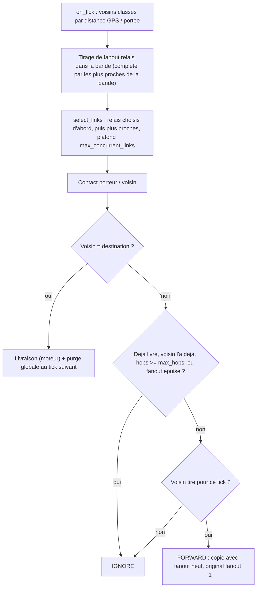

# `band_fanout` — Eventail borne sur une bande de distance + purge

Fichier : `src/festival_ble_sim/routing/band_fanout.py`
Hook moteur associe : `RoutingAlgorithm.select_links` (`routing/base.py`)
Balayage de variantes : `scripts/sweep_band_fanout.py`

## Principe

Objectif : etendre la diffusion sans inonder, en evitant les relais en bord
de portee ou le shadowing fait perdre des paquets.

1. **Choix des relais a chaque tick** (`on_tick`) : pour chaque porteur avec
   un buffer non vide, on classe ses voisins par `distance GPS bruitee /
   portee radio`. Ceux dont le ratio tombe dans `band` (defaut 0.4-0.6, soit
   12 a 18 m pour 30 m de portee, environ 6 a 11 dB de marge de liaison)
   sont candidats (on ecarte d'abord les voisins qui ont deja tous les
   messages en attente ou qui en sont la destination) ; on en tire `fanout` (defaut 3) au hasard (graine `seed`).
   S'il y en a moins que `fanout`, on complete avec les voisins les plus
   proches de la bande.
2. **Eventail borne** : chaque copie peut etre relayee `fanout` fois
   (compteur tenu par couple porteur/message dans l'algorithme, pas dans
   `routing_state`). La copie relayee repart avec un budget neuf, y compris
   une copie clonee par le backhaul des beacons ; l'originale decremente le
   sien. Un porteur sans aucun message relayable ne calcule pas de selection. Budget epuise : il ne reste que la
   livraison directe (gestion moteur, hors `decide`).
3. **Plafond de sauts** : `max_hops` (defaut 4), en plus du TTL du moteur.
4. **Liaisons** : le moteur limite chaque emetteur a `max_concurrent_links`
   (6) voisins. Par defaut les plus proches gagnent, ce qui rendrait la bande
   inatteignable en foule dense. `band_fanout` surcharge `select_links` :
   les destinataires des messages portes passent en premier (la livraison
   directe contourne `decide` mais a besoin d'un lien), puis les relais
   choisis (les plus proches parmi eux si le plafond coupe), puis les plus
   proches du reste. Le plafond reste respecte.
5. **Purge globale** (`purge_delivered=True`) : a la livraison, le message
   est marque livre ; a chaque tick il est supprime du buffer de tous les
   noeuds actifs, et `decide` l'ignore.

## Diagramme

## Parametres

| Parametre | Defaut | Role |
|---|---|---|
| `fanout` | 3 | relais par copie (>= 1) |
| `max_hops` | 4 | sauts maximum (>= 1) |
| `band` | (0.4, 0.6) | fenetre de distance / portee, `0 <= bas < haut` |
| `seed` | 0 | RNG du tirage des relais |
| `purge_delivered` | True | purge globale a la livraison |

Un arbre complet de copies peut atteindre `1 + 3 + 3^2 + 3^3 + 3^4 = 121`
porteurs avec les defauts.

## Ecarts avec un vrai protocole

- La purge et la liste des messages livres sont globales et instantanees
  (instance partagee, aucun temps radio) : c'est optimiste, comme pour
  `dasfv` ou `fresh_spray`.
- Le classement des voisins utilise la position GPS bruitee (`gps_position()`)
  du porteur et de chaque voisin, sans cout energetique de fix facture.
- Le choix des relais se fait dans `on_tick` : sans `ble_config`, le moteur
  n'appelle pas `on_tick` et l'algo ne relaie rien.
- Pas d'eviction dediee (FIFO du moteur).

## Resultats (balayage de variantes)

`scripts/sweep_band_fanout.py`, mobilite `poi`, 500 festivaliers, 3600 s,
6 bornes, `reply_probability` 0.5, moyenne des seeds 1-3. Archive :
`archives/2026-10-09_09-47-35_sweep_band_fanout.csv` (+ `.json`).

| variante | livraison | latence moy. (s) | p95 (s) | overhead | energie (mAh) |
|---|---|---|---|---|---|
| `fanout=2` | 0.824 | 404 | 1265 | 35.5 | 4 836 |
| `max_hops=3` | 0.854 | 374 | 1155 | 42.0 | 5 949 |
| **defauts** (fanout 3, max_hops 4) | 0.908 | 273 | 847 | 82.4 | 11 798 |
| `band_low=0, band_high=1` (pas de bande) | 0.913 | 259 | 804 | 84.3 | 12 578 |
| `fanout=4` | 0.926 | 236 | 724 | 109.7 | 16 409 |
| `max_hops=5` | 0.927 | 222 | 700 | 114.8 | 16 943 |
| `purge_delivered=0` | 0.847 | 270 | 848 | 140.3 | 17 545 |

- `fanout` et `max_hops` sont les leviers principaux : la livraison monte avec
  eux, mais l'energie et l'overhead aussi (fanout 2 -> 4 : 0.82 -> 0.93 pour
  3.4x l'energie).
- **La bande n'apporte rien de mesurable ici** : sans bande (0-100 %), la
  livraison et la latence sont meilleures de quelques points, au prix de +7 %
  d'energie et de +18 % de paquets perdus (88 k contre 75 k). L'hypothese de
  depart (eviter le bord de portee pour perdre moins) n'est confirmee que sur
  les pertes, pas sur la livraison.
- La purge globale est indispensable : sans elle, l'arbre de copies continue
  d'etre transmis, la livraison baisse (0.85 contre 0.91) et l'energie monte
  de 49 %.
- Trois seeds, un seul scenario : les ecarts de moins de 1 point de livraison
  (bande, `max_hops=5` contre `fanout=4`) sont dans le bruit.
- L'archive `archives/2026-10-09_11-41-27_comparaison.csv` compare
  `band_fanout` a d'autres algos mais est incomplete (graine 3 absente),
  elle n'est pas utilisee ici.

## Forces

- Livraison elevee (0.91 a 500 festivaliers en `poi`) avec peu de
  parametres, et latence basse.
- Le cout est directement regle par `fanout` et `max_hops`.
- La bande et `select_links` evitent que le plafond de liaisons ne fasse du
  relais toujours le voisin le plus proche.

## Faiblesses

- Plus gourmand en energie et en overhead que `spray_wait` : pas de budget
  global de copies, chaque copie relayee repart avec un budget neuf.
- La bande de distance n'a pas prouve son interet (voir ci-dessus).
- Purge et ACK globaux et gratuits ; la position GPS est supposee disponible
  chez tous les voisins.
- Pas de notion de destination : les relais sont tires au hasard, sans
  utiliser `dst_position` ni l'historique de rencontres.
