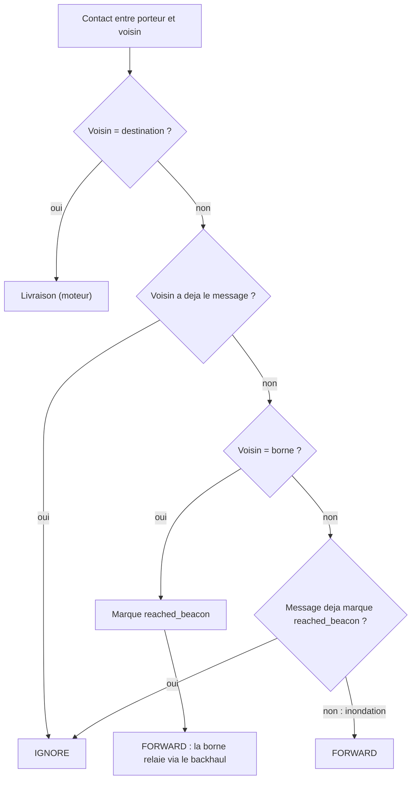

# `beacon_priority` — priorite aux bornes

Fichier : `src/festival_ble_sim/routing/beacon_priority.py`

## Principe

Inondation epidemique entre telephones jusqu'a ce qu'une copie atteigne
une borne. Le message est alors marque `reached_beacon` et les telephones
arretent de le propager : le backhaul des bornes prend le relais.

## Diagramme

Decision prise pour chaque message du porteur a chaque contact :

## Forces

- Tres simple, exploite directement l'infrastructure.
- Reduit l'inondation une fois le message pris en charge par une borne.

## Faiblesses

- Sans borne, c'est exactement `epidemic`, avec les memes defauts de
  saturation.
- Le marquage ne coupe que les copies qui ont vu une borne : les autres
  continuent d'inonder, l'overhead reste proche d'`epidemic`.
- Depend fortement du nombre et du placement des bornes.
