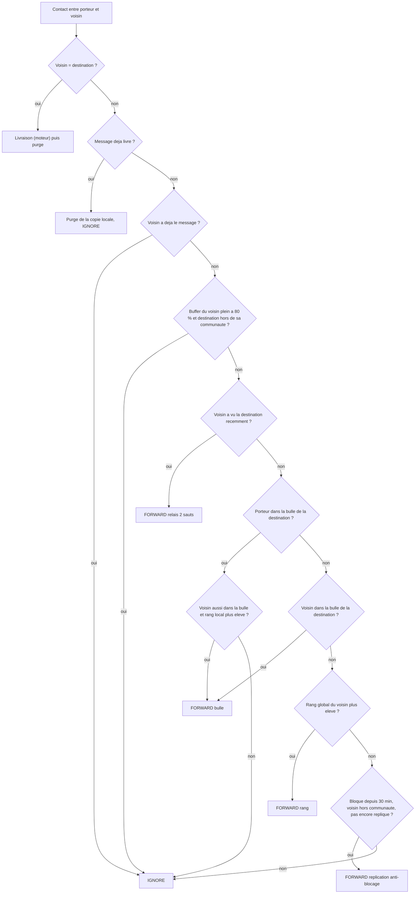

# `bubble_f` — BUBBLE-F (routage social)

Fichier : `src/festival_ble_sim/routing/bubble_f.py`

## Principe

Inspire de BUBBLE Rap :
- communautes amorcees par un graphe d'amis genere au lancement (groupes
  de 2 a 8, 20 % d'utilisateurs sans ami par defaut), enrichies par
  SIMPLE (familiers apres 20 min de contact cumule, ajout par
  recouvrement, fusion) ;
- rangs global et local C-Window (4 fenetres de 30 min) ;
- budget de 8 jetons en division binaire : entrer dans la bulle du
  destinataire, sinon monter en rang global, puis en rang local a
  l'interieur ;
- relais a 2 sauts, replication anti-blocage apres 30 min sans progres,
  admission restreinte des buffers pleins a 80 %, epoques optionnelles
  (`epoch_s`).

Bloom, `rankCap`, SOS et RSSI ne sont pas modelises.

## Diagramme

Decision prise pour chaque message du porteur a chaque contact :

## Forces

- Tres econome en transmissions et en energie, pas de saturation des
  buffers.
- Pertinent des qu'il existe une vraie structure sociale (groupes d'amis
  qui se deplacent ensemble, habitues d'une scene).
- L'admission restreinte et l'anti-blocage evitent a la fois la
  saturation et les messages coinces indefiniment.

## Faiblesses

- Avec `random_waypoint`, les amis ne se deplacent pas ensemble : les
  bulles ne correspondent a aucune proximite reelle et la livraison
  chute. L'algorithme attend un modele de mobilite de groupe qui n'existe
  pas encore.
- Les rangs C-Window demandent du temps pour se construire (fenetres de
  30 min) : faible sur des runs courts.
- Le graphe d'amis est synthetique : le comportement depend fortement de
  `group_size_range` et `no_friend_fraction`.
- Beaucoup de parametres et de mecanismes imbriques.
