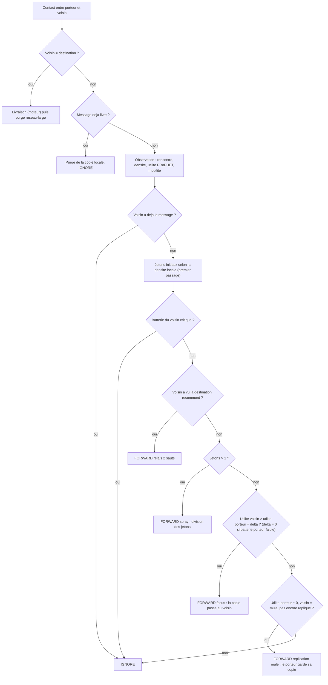

# `dasfv` — DASF-V (Density-Aware Spray-and-Focus + purge)

Fichier : `src/festival_ble_sim/routing/dasfv.py`

## Principe

Version reduite au niveau reseau (pas de crypto, GATT, SOS ni epoques ;
voir l'en-tete du fichier) :
- budget de copies initial adapte a la densite locale (entre `k_min` et
  `l_max`, reference `l_base`) ;
- phase *spray* (division des jetons) puis phase *focus* par gradient
  d'utilite PRoPHET ;
- relais a 2 sauts (voisin qui a vu la destination recemment) et
  heuristique de *mule* (noeud mobile a fort renouvellement de contacts) ;
- politique batterie : refus des pairs en batterie critique, evacuation
  acceleree depuis un porteur en batterie faible ;
- purge reseau-large des copies une fois le message livre.

## Diagramme

Decision prise pour chaque message du porteur a chaque contact :

## Forces

- Combine le budget borne de Spray and Wait et l'orientation de PRoPHET.
- S'adapte a la densite au lieu d'un `L` fixe.
- Le mode focus evite la longue phase wait aveugle de Spray and Wait.
- La purge libere buffers et energie apres livraison.
- Protege les telephones en fin de batterie.

## Faiblesses

- Beaucoup de parametres (une vingtaine) : calibration delicate, risque de
  sur-ajustement a un scenario.
- Les vues exactes de l'instance partagee (densite, 2 sauts, purge
  instantanee) sont optimistes par rapport a un vrai deploiement ou ces
  informations transitent par des balises ou des filtres de Bloom.
- Latence plus elevee que les approches par inondation.
- L'economie porte surtout sur l'overhead, moins sur la consommation radio
  de fond.
