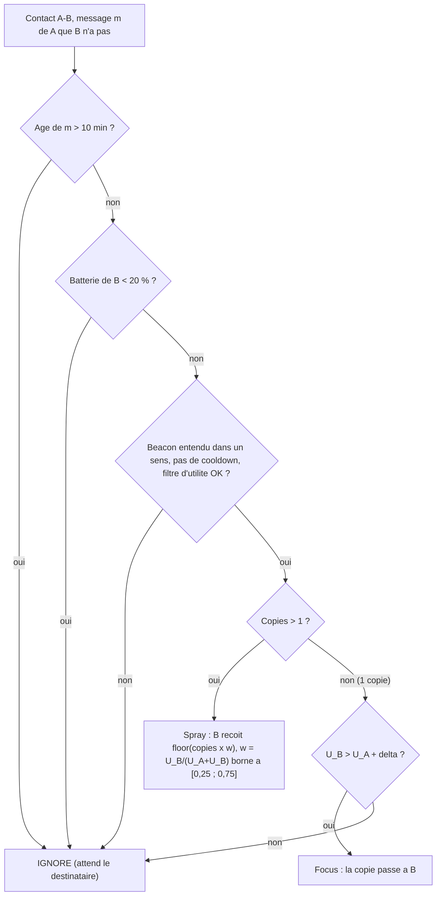

# `eco_sf` — ECO-SF (Energy-Constrained Opportunistic Spray & Focus)

Fichier : `src/festival_ble_sim/routing/eco_sf.py`
Spec : `docs/algorithmes/specs/ECO-SF.md`

## Principe

Spray-and-Focus sans GPS qui cherche a limiter les reveils radio et les
connexions :
- chaque noeud emet des beacons a cadence Trickle (Imin 2 s, Imax
  30/60/120 s selon la batterie, suppression k = 1), remise a Imin sur
  nouveau voisin, message cree ou recu, purge ;
- une paire ne peut se connecter que si l'un des deux a entendu un beacon
  de l'autre (entree valable `3 x Imax`), avec un cooldown de 20 s par
  paire ; la livraison directe au destinataire reste geree par le moteur ;
- connexion seulement si le porteur a un message pour le pair, ou un
  message que le pair n'a pas et pour lequel son utilite depasse
  `dest_bloom_threshold` (0,05) ;
- utilite PRoPHET allegee : renforcement sur nouveau voisin entendu,
  vieillissement par minute, table de 64 entrees, transitivite sur les 32
  meilleures, appliquee seulement a l'ouverture d'une connexion ;
- budget de 2 a 16 copies fixe a la creation selon les voisins entendus
  sur 60 s ; spray pondere par l'utilite (part `w` dans [0,25 ; 0,75]),
  puis focus si `U_pair > U_porteur + delta` ;
- apres 10 min, plus de relais (livraison directe seulement) ;
- batterie < 20 % : refuse les relais ; < 10 % : muet sauf message propre ;
- eviction : acquittes/expires d'abord, puis plus faible priorite
  (utilite x temps restant), jamais un message propre s'il reste un tiers.

Omis : Bloom filters (ensembles exacts), ACK signes (purge globale
instantanee), ordre de transfert par priorite, EWMA de la densite, plafond
anti-spam des resets. `stats` compte `beacons`, `trickle_resets`,
`connections`, `spray`, `focus`.

## Diagramme

## Forces

- Tres sobre : surcharge ~24 et ~1 200 mAh au total a 1 000 festivaliers
  sur 30 min, contre ~6 200 pour `fresh_spray` et ~3 450 pour `dasfv`.
- Aucun GPS, aucune position qui circule.
- Politique batterie explicite (Imax allonge, refus des relais, mode muet).
- `stats` donne le proxy energie de la spec (beacons, connexions) faute
  de cout modelise par le moteur.

## Faiblesses

- Livraison tres basse en l'etat : 12,4 % (1 graine, 30 min), contre
  33 % pour `dasfv` et 79 % pour `fresh_spray`.
- La suppression Trickle cache des voisins : Trickle fait converger un
  etat partage, ce n'est pas un mecanisme de decouverte.
- Le filtre de connexion bloque le spray : les copies ne vont qu'a qui a
  deja croise le destinataire (21 % de livraison sans ce filtre).
- Meme tout relache, reste sous `dasfv` (19 % contre 33 %) ; hypothese non
  verifiee : connexions d'un seul tick + cooldown de 20 s sur un lien a
  pertes.
- L'economie de beacons n'apparait pas dans l'energie du rapport : le
  moteur facture un courant de fond fixe quel que soit l'algorithme.
- Toutes les valeurs numeriques sont des points de depart non valides.
