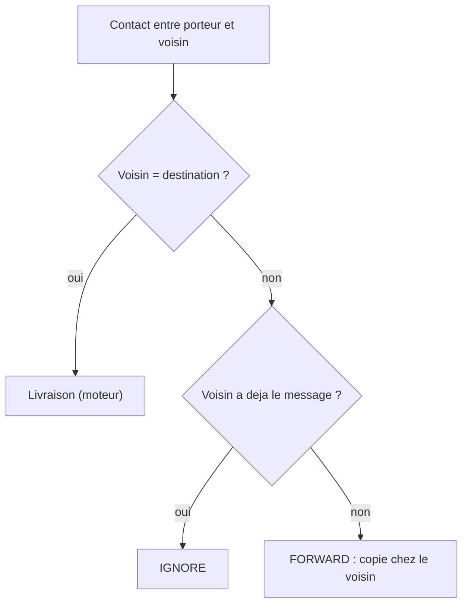

# `epidemic` — inondation naive

Fichier : `src/festival_ble_sim/routing/epidemic.py`

## Principe

A chaque contact, le porteur transmet tout message que le voisin n'a pas
encore. C'est l'algorithme de reference : borne haute d'overhead et, en
theorie, borne basse de latence.

## Diagramme

Decision prise pour chaque message du porteur a chaque contact :

## Forces

- Trivial (une condition), aucun etat, aucun parametre.
- Latence minimale tant que le reseau n'est pas sature : explore tous les
  chemins en parallele.
- Sert de reference pour mesurer ce que les autres algorithmes economisent.

## Faiblesses

- Overhead enorme : chaque message finit copie chez presque tout le monde,
  ce qui sature batterie, buffers et canal radio.
- En foule dense, la saturation se retourne contre lui : evictions de
  buffer et collisions radio font chuter le taux de livraison.
- Aucun nettoyage apres livraison : les copies continuent de circuler.
