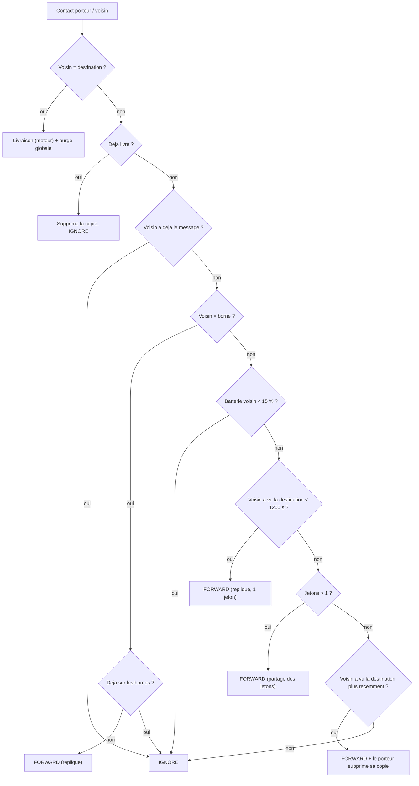

# `fresh_spray` — Spray + fraicheur de contact + bornes + purge

Fichier : `src/festival_ble_sim/routing/fresh_spray.py`

## Principe

Objectif : maximiser la livraison tout en minimisant latence et energie.

1. **Spray binaire** : le message nait avec `initial_tokens` jetons (defaut
   16), partages moitie/moitie a chaque forward.
2. **Voisin qui a croise la destination** : si le voisin a vu la destination
   il y a moins de `met_dst_window_s` (defaut 1200 s), il recoit une replique
   (1 jeton), meme quand le porteur n'a plus de jetons a distribuer.
3. **Focus FRESH** : avec la derniere copie, le porteur la *cede* (il la
   supprime de son buffer) au voisin qui a vu la destination plus recemment
   que lui (`min_freshness_gain_s`, defaut 5 s).
4. **Bornes** : une seule replique vers la premiere borne croisee ; le
   backhaul la diffuse aux autres, qui gardent leur copie jusqu'au passage de
   la destination.
5. **Purge globale** : des qu'un message est livre, toutes ses copies sont
   supprimees (`on_tick`). Moins de copies en buffer = moins d'energie
   gaspillee sur les pertes et moins de contention.
6. Les voisins avec moins de 15 % de batterie ne recoivent pas de relais.

## Diagramme

## Resultats (seed 42, 500 festivaliers, 3600 s)

| algo | bornes | livraison | latence moy. (s) | energie (mAh) |
|---|---|---|---|---|
| fresh_spray | 0 | 0.723 | 553 | 772 118 |
| fresh_spray | 6 | 0.817 | 435 | 647 012 |
| dasfv | 0 | 0.567 | 619 | 856 947 |
| dasfv | 6 | 0.627 | 557 | 827 603 |
| gossip_a | 0 | 0.488 | 645 | 1 418 911 |
| gossip_a | 6 | 0.487 | 631 | 1 431 574 |
| spray_wait | 0 | 0.419 | 714 | 560 555 |
| epidemic | 0 | 0.259 | 658 | 1 436 838 |

## Forces

- Meilleure livraison et latence de tous les algos testes, avec ou sans
  bornes, pour moins d'energie que `dasfv`/`gossip_a`/`epidemic`.
- Exploite bien les bornes (replique unique, pas d'inondation).
- Trois parametres, comportement lisible.

## Faiblesses

- La table "qui a vu qui" et la purge sont globales et instantanees (instance
  partagee), pas diffusees sur BLE : c'est optimiste, comme pour `dasfv`.
- Plus gourmand que `spray_wait` sur l'energie (plus de copies).
- Reglages (`initial_tokens`, `met_dst_window_s`) calibres sur un seul
  scenario (500 noeuds, random waypoint) ; a re-verifier pour d'autres
  densites ou mobilites.
