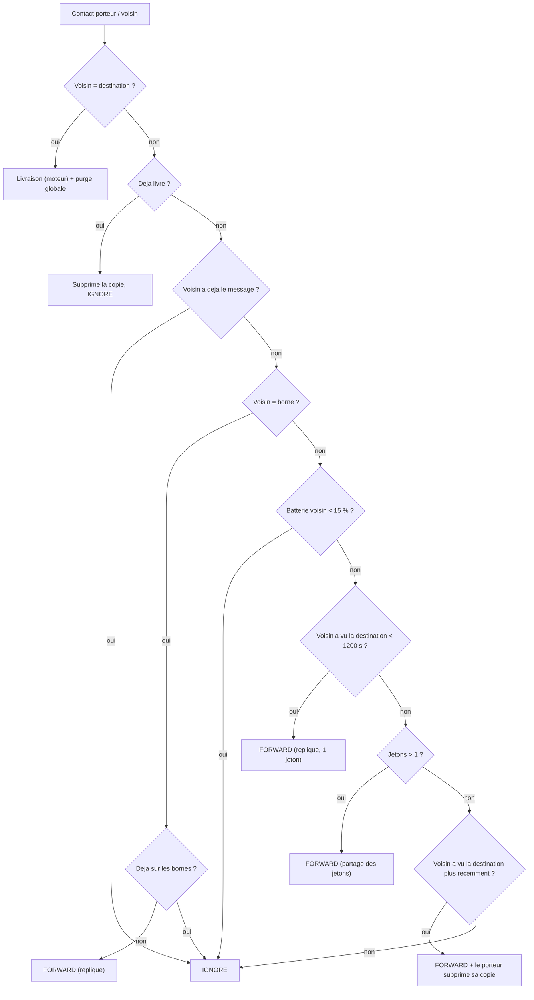

# `fresh_spray` — Spray + fraicheur de contact + bornes + purge

Fichier : `src/festival_ble_sim/routing/fresh_spray.py`
Spec : `docs/algorithmes/specs/FRESH-SPRAY.md`

## Principe

Objectif : maximiser la livraison tout en minimisant latence et energie.

1. **Spray binaire** : le message nait avec `initial_tokens` jetons (defaut
   16), partages moitie/moitie a chaque forward.
2. **Voisin qui a croise la destination** : si le voisin a vu la destination
   il y a moins de `met_dst_window_s` (defaut 1200 s), il recoit une replique
   (1 jeton), meme quand le porteur n'a plus de jetons a distribuer.
3. **Focus FRESH** : avec la derniere copie, le porteur la *cede* (il la
   supprime de son buffer) au voisin qui a vu la destination plus recemment
   que lui (`min_freshness_gain_s`, defaut 5 s).
4. **Bornes** : une seule replique vers la premiere borne croisee ; le
   backhaul la diffuse aux autres, qui gardent leur copie jusqu'au passage de
   la destination.
5. **Purge globale** : des qu'un message est livre, toutes ses copies sont
   supprimees (`on_tick`). Moins de copies en buffer = moins d'energie
   gaspillee sur les pertes et moins de contention.
6. Les voisins avec moins de 15 % de batterie ne recoivent pas de relais.

## Diagramme

## Resultats (seed 42, 500 festivaliers, 3600 s)

| algo | bornes | livraison | latence moy. (s) | energie (mAh) |
|---|---|---|---|---|
| fresh_spray | 0 | 0.723 | 553 | 772 118 |
| fresh_spray | 6 | 0.817 | 435 | 647 012 |
| dasfv | 0 | 0.567 | 619 | 856 947 |
| dasfv | 6 | 0.627 | 557 | 827 603 |
| gossip_a | 0 | 0.488 | 645 | 1 418 911 |
| gossip_a | 6 | 0.487 | 631 | 1 431 574 |
| spray_wait | 0 | 0.419 | 714 | 560 555 |
| epidemic | 0 | 0.259 | 658 | 1 436 838 |

## Balayage de `initial_tokens` (5000 festivaliers, 10 800 s)

`scripts/sweep_fresh_spray_tokens.py`, mobilite `poi`, 6 bornes,
`reply_probability` 0.5, moyenne des seeds 1-3. Archive :
`archives/2026-10-07_10-04-26_sweep_fresh_spray_tokens.csv` (+ `.json`).

| initial_tokens | livraison | latence moy. (s) | p95 (s) | overhead | energie (mAh) |
|---|---|---|---|---|---|
| 4 | 0.813 | 490 | 1411 | 509 | 1 484 852 |
| 8 | 0.821 | 469 | 1388 | 528 | 1 566 066 |
| **16** | **0.822** | **448** | **1352** | **572** | **1 688 835** |
| 32 | 0.818 | 430 | 1335 | 641 | 1 893 575 |

- La livraison plafonne (0.81-0.82, ecart du meme ordre que le bruit entre
  seeds).
- Chaque doublement gagne ~20 s de latence (~4 %) mais coute de plus en plus
  d'energie (+5 %, +8 %, +12 %).
- Le defaut 16 est garde : meilleure livraison, et 32 paie +12 % d'energie
  pour -4 % de latence. Les jetons sont un levier faible (x8 jetons = -12 %
  de latence) : la latence est dominee par la mobilite.
- Pistes plus prometteuses vues dans ce balayage : `avg_hops` ~8.5 pour un
  TTL de 8 sauts (le TTL bride probablement `met_dst`), ~10 M evictions de
  buffer (buffers de 100 pleins, eviction FIFO), et un p95 proche du
  `message_ttl_s` de 1800 s.

Par rapport a la comparaison a 500 festivaliers ci-dessus (0.817 / 435 s avec
6 bornes), fresh_spray garde la meme livraison a 10x la densite et en
mobilite `poi`, avec une latence du meme ordre.

## Forces

- Meilleure livraison et latence de tous les algos testes, avec ou sans
  bornes, pour moins d'energie que `dasfv`/`gossip_a`/`epidemic`.
- Exploite bien les bornes (replique unique, pas d'inondation).
- Trois parametres, comportement lisible.

## Faiblesses

- La table "qui a vu qui" et la purge sont globales et instantanees (instance
  partagee), pas diffusees sur BLE : c'est optimiste, comme pour `dasfv`.
- Plus gourmand que `spray_wait` sur l'energie (plus de copies).
- `met_dst_window_s` n'est calibre que sur un seul scenario (500 noeuds,
  random waypoint) ; `initial_tokens` a ete re-verifie a 5000 noeuds en
  mobilite `poi` (voir le balayage ci-dessus).
