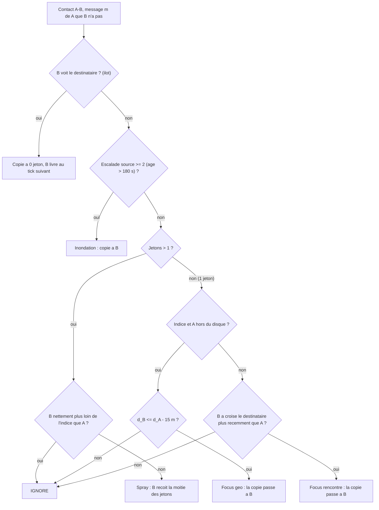

# `geo_spray_focus` — GSF (Geo Spray-and-Focus)

Fichier : `src/festival_ble_sim/routing/geo_spray_focus.py`
Spec : `docs/algorithmes/specs/GSF.md`

## Principe

Spray-and-Focus autonome (pas une sous-classe de TIDE) guide par la
derniere position connue du destinataire (`message.dst_position`) :
- indice utilisable s'il a moins de 15 min, arrondi a une case de 25 m,
  disque d'incertitude `r = 30 m + 0,3 m/s x age` ;
- budget de 2 a 12 jetons selon l'aire du disque (12 sans indice) ;
- spray binaire (moitie-moitie), refuse a un voisin nettement plus loin de
  l'indice que le porteur ;
- focus : la derniere copie passe a un voisin au moins 15 m plus pres de
  l'indice tant que le porteur est hors du disque ; dans le disque ou sans
  indice, a qui a croise le destinataire le plus recemment ;
- ilots : un voisin qui voit le destinataire recoit toujours une copie ;
- escalade par la source (qui garde une copie fantome) : 12 jetons sans
  geographie a 60 s, puis inondation a 180 s, bornee par le TTL de 8
  sauts du moteur ;
- purge de toutes les copies au tick suivant la livraison ; l'ACK renvoie
  la position du destinataire a la source (comme `tide_g2`).

`stats` repartit les transmissions par raison (`island`, `flood`, `spray`,
`focus_geo`, `focus_encounter`) et compte les escalades. Variante sans
GPS : `GeoSprayFocusRouting(hint_max_age_s=1e-9, gps_policy="carriers",
ack_hint=False)`.

## Diagramme

## Forces

- Livraison nettement au-dessus de TIDE-G (+14 a +21 points a 400
  festivaliers, 3 graines), et meme d'Epidemic, pour ~1/8 de sa surcharge
  et ~1/5 de son energie.
- p95 bien meilleur que TIDE-G (~13 min au lieu de ~17).
- La variante sans GPS livre autant : aucune permission de localisation,
  aucune position qui circule, 5 a 6 mAh/noeud economises.
- Robuste a la falsification des jetons ou de l'indice : l'escalade de la
  source garantit l'inondation finale.

## Faiblesses

- Tout le gain vient de l'inondation tardive (72 a 75 % des
  transmissions) ; sans elle, GSF retombe au niveau de TIDE-G. La
  geographie n'apporte rien (focus geo = 1 a 3 % des transmissions).
- Comparaison inequitable en l'etat : TIDE n'inonde pas. Le temoin
  « TIDE + inondation tardive » reste a mesurer.
- Surcharge x2,5 et energie x1,9 a x2,3 par rapport a TIDE-G.
- L'inondation peut saturer le canal en foule dense (4 000 festivaliers) :
  non mesure, le resultat peut s'inverser.
- Escalade non propagee aux copies deja distribuees ; positions des
  voisins lues dans une table globale au lieu d'etre echangees.
