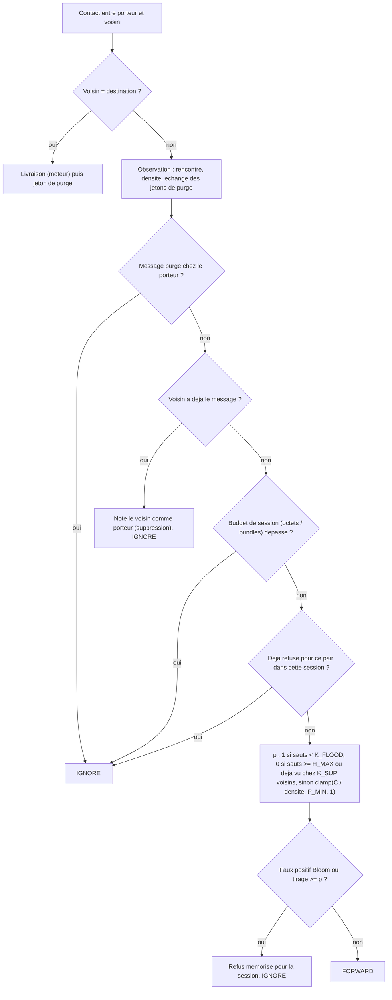

# `gossip_a` — GOSSIP-A (gossip probabiliste adaptatif)

Fichier : `src/festival_ble_sim/routing/gossip_a.py`

## Principe

Version reduite au niveau reseau (pas de crypto, etiquettes, PoW ni SOS) :
- probabilite de retransmission `p = clamp(C / densite, P_MIN, 1)`, tiree
  une fois par (message, pair) et par session ;
- inondation totale des `K_FLOOD` premiers sauts, borne `H_MAX` ;
- anti-entropie par resume Bloom (faux positifs simules) ;
- suppression par compteur (message deja vu chez `K_SUP` voisins) ;
- jetons de purge propages de proche en proche apres livraison ;
- budgets par session (octets, bundles) et eviction « plus repliques
  d'abord » (`choose_eviction`).

Les interrupteurs `adaptive`, `suppression` et
`replicated_first_eviction` permettent des ablations.

## Diagramme

Decision prise pour chaque message du porteur a chaque contact :

## Forces

- Livraison elevee et latence basse : se rapproche de l'inondation sans en
  avoir tout le cout.
- Tire bien parti des bornes.
- Adaptatif a la densite : inonde en zone clairsemee, se retient en foule.
- L'eviction « plus repliques d'abord » protege les messages rares quand
  les buffers saturent.
- Modelise des imperfections realistes (faux positifs Bloom, budgets de
  session).

## Faiblesses

- Overhead nettement plus eleve que les approches a budget de copies
  (`spray_wait`, `dasfv`, `bubble_f`).
- Consommation d'energie proche de l'inondation.
- Aleatoire (RNG propre, `seed`) : resultats plus variables d'un seed a
  l'autre.
- Nombreux parametres (`C`, `P_MIN`, `K_FLOOD`, `H_MAX`, `K_SUP`,
  fenetres, budgets).
