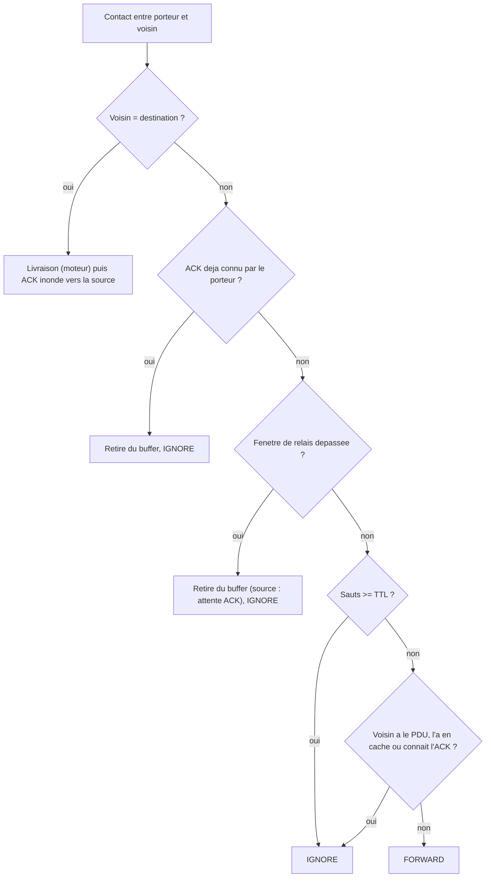

# `managed_flood` — inondation geree (Bluetooth Mesh)

Fichier : `src/festival_ble_sim/routing/managed_flood.py`

## Principe

Reduction au niveau reseau de l'inondation geree du Bluetooth Mesh, sans
stockage-transport :
- un noeud ne relaie un PDU que pendant `relay_window_s` apres l'avoir
  recu, puis l'oublie (la source aussi) ;
- TTL en sauts (`ttl`) : au-dela, plus de relais ;
- cache de messages par noeud, taille fixe (`cache_size`, FIFO, cle
  `(msg_id, SEQ)`) : tout PDU deja vu est rejete, meme apres oubli du
  contenu ;
- mode acquitte (`acknowledged=True`, defaut) : la destination emet un ACK
  propage par inondation geree (memes regles TTL/fenetre) qui purge les
  copies ; sans ACK apres `ack_timeout_s`, la source reemet avec un
  nouveau SEQ (nouveau PDU pour les caches), au plus
  `max_source_retransmissions` fois.

Chaque saut d'ACK coute l'energie tx/rx de `ack_size_bytes` (defaut 16 o,
cout calcule avec `EnergyConfig` par defaut ou celui passe en `energy`).

Non modelise : chiffrement, IV index, relais friend/low-power, temps
d'antenne des ACK (le budget de lien du moteur ne les voit pas).

## Diagramme

Decision prise pour chaque message du porteur a chaque contact :

A chaque tick, hors contact : les PDU hors fenetre sont retires des
buffers, les ACK se propagent d'un saut, et une source sans ACK apres
`ack_timeout_s` reemet avec un nouveau SEQ (ou abandonne apres
`max_source_retransmissions`).

## Forces

- Sans tempete : chaque noeud recoit et relaie un PDU une seule fois
  (cache + fenetre), bien moins de transmissions qu'`epidemic`.
- Buffers quasi vides : un PDU ne vit que quelques secondes par noeud.
- Latence minimale quand un chemin existe : un saut par tick.
- Deterministe, aucune connaissance globale requise pour decider.
- Fidele a un protocole reel (Bluetooth Mesh), reference utile face aux
  algos DTN.

## Faiblesses

- Pas de stockage-transport : si la destination n'est pas joignable
  pendant la fenetre, le message est perdu (hors reemissions). En festival
  clairseme, la livraison chute nettement face aux algos DTN.
- Les reemissions de la source ne rattrapent que des coupures courtes
  (`ack_timeout_s` x `max_source_retransmissions`).
- Le TTL ne borne que le relais : le moteur livre encore a la destination
  un PDU dont les sauts ont atteint le TTL (regle commune a tous les
  algos, plus permissive que le Bluetooth Mesh).
- Le cache de taille fixe peut oublier un PDU sous forte charge et le
  laisser repasser.
- Les ACK ne consomment pas de bande passante dans le modele.
