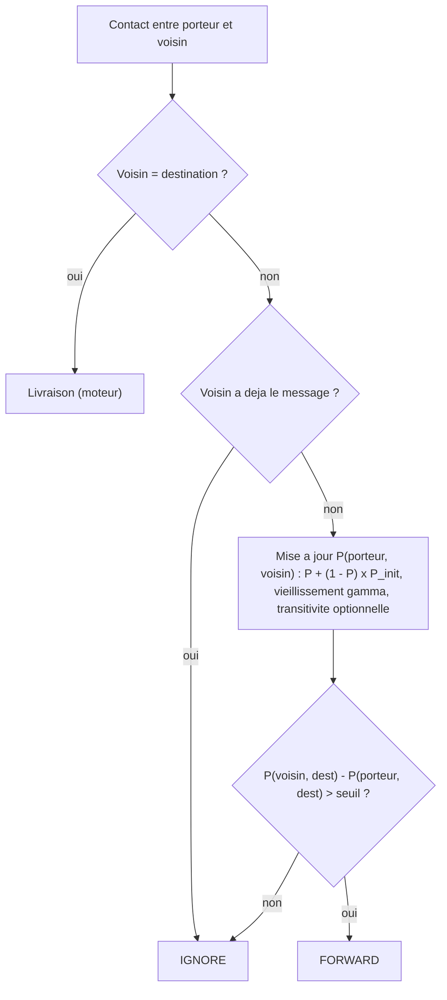

# `prophet` — routage probabiliste PRoPHET

Fichier : `src/festival_ble_sim/routing/prophet.py`

## Principe

L'instance partagee maintient une predictabilite de rencontre `P(a, b)`
par paire de noeuds :
- augmentee a chaque rencontre (`p_encounter_init`) ;
- vieillie exponentiellement avec le temps (`gamma`) ;
- optionnellement transitive (`enable_transitivity`, `beta`, desactivee
  par defaut).

Un message est transmis seulement si le voisin a une meilleure
predictabilite vers la destination que le porteur (au-dela de
`forwarding_threshold`).

## Diagramme

Decision prise pour chaque message du porteur a chaque contact :

## Forces

- Oriente : les copies vont vers les noeuds qui croisent souvent la
  destination.
- Overhead modere sans budget de copies explicite.
- Tire parti des habitudes de deplacement (ex. mobilite `poi`).

## Faiblesses

- Demarrage a froid : tant que l'historique de contacts est vide, peu de
  forwards, d'ou une latence elevee.
- Pas de borne sur le nombre de copies : un gradient bruite peut quand
  meme beaucoup repliquer.
- Avec `random_waypoint`, les rencontres sont peu repetitives et la
  predictabilite porte peu d'information.
- La transitivite parcourt toute la table : couteuse a grande echelle.
- N'exploite pas specifiquement les bornes.
