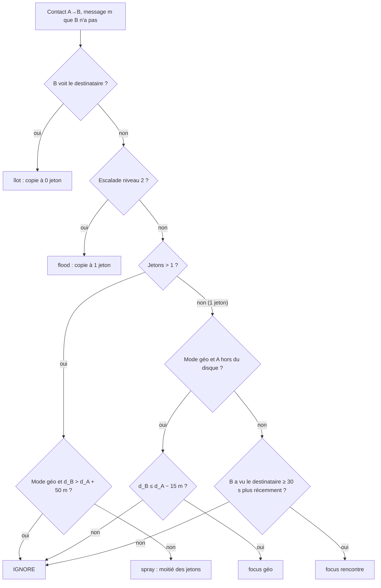

# GSF — Geo Spray-and-Focus

GSF est un algorithme de routage DTN unicast **autonome** (il ne dérive pas de TIDE) : un Spray-and-Focus dont le nombre de copies et le choix des relais dépendent de la dernière position connue du destinataire. Quand l'indice de position manque ou est trop vieux, il se replie sur un Spray-and-Focus classique par rencontres. Si rien n'est livré, la source élargit d'elle-même : d'abord plus de copies, puis l'inondation.

Il entre dans la comparaison comme candidat indépendant, face à TIDE, TIDE-G et TIDE-G2.

> **Statut** : implémenté dans `src/festival_ble_sim/routing/geo_spray_focus.py`, 9 tests dans `tests/test_routing_geo_spray_focus.py`. Une campagne de 90 simulations (§5, faite sur un prototype) a mesuré GSF et 6 variantes. GSF s'appuie sur `gps_fix()` et les rafales de messages ajoutés avec TIDE-G2 (`docs/algorithmes/specs/TIDE-G2.md`).

> **Résultat principal** (§5) : GSF livre 14 à 21 points de plus que TIDE-G, mais **tout ce gain vient de l'inondation tardive, pas de la géographie**. Avec la géographie désactivée (aucun GPS), GSF livre exactement autant et consomme 5 à 6 mAh de moins par nœud.

---

## 1. Principe en une page

1. **Léa écrit à Paul.** Si elle connaît une position récente de Paul (reçue dans un message de Paul ou dans l'ACK de son dernier message), le message porte un **indice** : cette position, arrondie à une case de 25 m, avec son âge.
2. **Le budget de copies dépend de l'incertitude.** Autour de l'indice, un disque de rayon `r = 30 m + 0,3 m/s × âge`. Plus le disque est grand, plus il faut de copies pour le couvrir : de 2 copies (indice tout frais) à 12 (indice de 2 minutes ou plus).
3. **Spray orienté.** Tant qu'une copie a plusieurs jetons, elle les partage moitié-moitié, mais jamais avec un voisin nettement plus loin de l'indice que le porteur.
4. **Focus géographique.** La dernière copie passe à un voisin au moins 15 m plus près de l'indice. Une fois dans le disque, c'est la règle des rencontres qui prend le relais : la copie va à qui a croisé Paul le plus récemment.
5. **Îlots.** Un voisin qui voit Paul en ce moment reçoit toujours une copie, qu'il livrera au tick suivant.
6. **Pas d'indice, ou indice de plus de 15 min :** Spray-and-Focus par rencontres (spray binaire, puis focus vers qui a vu Paul le plus récemment).
7. **Escalade par la source.** Sans livraison après 60 s, la source remonte à 12 jetons et ignore la géographie. Après 180 s, elle inonde : chaque copie créée depuis va à tout voisin, dans la limite des 8 sauts du moteur.
8. **ACK.** Dès la livraison, toutes les copies sont purgées. L'ACK rapporte à Léa la position de Paul, chiffrée pour elle, ce qui donne un indice frais à son message suivant.

---

## 2. Spécification

### 2.1 Indice et rayon d'incertitude

Un message porte un indice utilisable si `dst_position` est connu et si son âge `h = now − dst_position_time` est d'au plus `hint_max_age_s` (15 min).

```
centre    = centre de la case de 25 m contenant dst_position
rayon     r(h) = r0 + v · h          (r0 = 30 m, v = 0,3 m/s)
```

Ce sont les valeurs calibrées pour TIDE-G sur la mobilité `poi` du simulateur : r(h) couvre environ 80 % des déplacements réels (`docs/algorithmes/specs/TIDE-G.md` §3.1). Le mode géographique ne s'applique que si `r(h) ≤ r_flood` (300 m, soit un indice d'environ 15 min) ; au-delà, l'indice ne sert plus.

### 2.2 Budget initial de copies

À la source, au premier routage :

```
L = clamp( ceil( l_max · (r(h) / r_focus)² ), l_min, l_max )      sans indice : L = l_max
```

avec `l_min = 2`, `l_max = 12` (comme TIDE), `r_focus = 120 m`. L'aire à couvrir croît en r², le budget aussi.

| Âge de l'indice | r(h) | Copies |
|---|---|---|
| 0 | 30 m | 2 |
| 2 min 30 | 75 m | 5 |
| 5 min et plus | ≥ 120 m | 12 |

### 2.3 Décision pour un contact A → B

Ordre d'évaluation, la première règle qui s'applique décide :

| # | Condition | Décision | Jetons de la copie de B |
|---|---|---|---|
| 1 | B voit le destinataire en ce moment | Transmettre (« îlot ») | 0 (livraison seulement) |
| 2 | Escalade de niveau 2 | Transmettre (« flood ») | 1 |
| 3 | Jetons > 1 et B plus loin de l'indice que A de plus de 50 m | Ignorer | — |
| 4 | Jetons > 1 | Transmettre (« spray ») | la moitié |
| 5 | 1 jeton, mode géo, A hors du disque | Transmettre si d_B ≤ d_A − 15 m (« focus géo »), sinon ignorer | 1, A supprime sa copie |
| 6 | 1 jeton, B a vu le destinataire au moins 30 s plus récemment que A | Transmettre (« focus rencontre ») | 1, A supprime sa copie |
| 7 | Sinon | Ignorer (store-carry-forward) | — |

« Mode géo » signifie : indice utilisable (§2.1), escalade de niveau 0, et fix GPS frais chez A **et** chez B. S'il manque l'un des trois, les règles 3 et 5 sont sautées et GSF se comporte comme un Spray-and-Focus par rencontres.

Les 15 m de progrès minimal, soit trois fois le bruit GPS, évitent les allers-retours dus au bruit. La source garde une **copie fantôme** à 0 jeton après un focus, pour pouvoir escalader.



### 2.4 Escalade par la source

La source réévalue l'âge de son message à chaque contact :

| Âge du message | Niveau | Effet |
|---|---|---|
| < 60 s | 0 | Normal |
| ≥ 60 s | 1 | Jetons remontés à `l_max`, règles géographiques désactivées |
| ≥ 180 s | 2 | Inondation : toute copie créée depuis la source va à tout voisin |

Le niveau voyage dans `routing_state` : les copies créées après l'escalade en héritent, et une copie de niveau 2 inonde à son tour. Les copies créées **avant** ne sont pas prévenues (il n'y a pas de canal pour ça), elles continuent en Spray-and-Focus. L'inondation reste bornée par le TTL de 8 sauts du moteur et par la purge à la livraison.

Les seuils 60 s et 180 s visent l'objectif du cahier des charges : livraison parfaite sous 2 min, acceptable sous 10 min.

### 2.5 GPS

- **Fixes périodiques**, toutes les 30 s, facturés `gps_current_ma × 30 / 3600` mAh (10 mA par défaut, comme TIDE-G) :
  - `gps_policy="all"` (défaut) : tout téléphone qui a au moins un voisin, ce qui correspond à « chacun annonce sa position au handshake » ;
  - `gps_policy="carriers"` : seulement les porteurs d'un message à indice. Moins cher, mais les voisins ont rarement un fix frais.
- Un fix de plus de 60 s ne compte pas. Les bornes ont leur position exacte, gratuitement.
- Les fixes passent par `node.gps_fix()`, donc respectent `GpsConfig.fix_failure_probability`.

### 2.6 ACK et purge

- **Purge** : à la livraison, le message est marqué livré ; toutes ses copies sont supprimées au tick suivant, partout. C'est la même simplification que `dasfv` et `fresh_spray` (ACK instantané et gratuit).
- **Position dans l'ACK** (`ack_hint`) : la position du destinataire (son fix frais, sinon un fix pris pour l'occasion) arrive chez la source après `ack_hint_delay_factor × latence aller`, comme dans TIDE-G2 (`docs/algorithmes/specs/TIDE-G2.md` §2.1). Elle alimente `known_positions`, donc l'indice du message suivant.
- **Rafraîchissement** : la source remplace l'indice de sa propre copie si elle a reçu une position plus récente entre-temps.

### 2.7 Éviction

Buffer plein : on évince d'abord les messages déjà livrés, puis expirés, puis ceux à moins de jetons, puis ceux qui ont fait le plus de sauts. Les messages dont le nœud est la source ne sont évincés qu'en dernier recours : si le buffer ne contient plus qu'eux, le moteur retombe sur son éviction FIFO (comme pour TIDE).

### 2.8 Paramètres

| Paramètre | Défaut | Rôle |
|---|---|---|
| `hint_max_age_s` | 900 s | Âge maximal d'un indice |
| `hint_cell_m` | 25 m | Arrondi de l'indice (vie privée) |
| `hint_r0_m`, `drift_mps` | 30 m, 0,3 m/s | Rayon d'incertitude |
| `r_focus_m` | 120 m | Rayon où le budget atteint `l_max` |
| `r_flood_m` | 300 m | Au-delà, l'indice ne sert plus |
| `l_min`, `l_max` | 2, 12 | Bornes du budget |
| `radius_tokens` | `True` | `False` : toujours `l_max` copies |
| `spray_slack_m` | 50 m | Tolérance du spray orienté |
| `min_progress_m` | 15 m | Progrès minimal du focus géo |
| `min_freshness_gain_s` | 30 s | Gain minimal du focus rencontre |
| `island_delivery` | `True` | Règle des îlots |
| `escalation_schedule_s` | (60, 180) s | Seuils d'escalade ; `None` : pas d'escalade |
| `gps_period_s`, `fix_max_age_s` | 30 s, 60 s | Fixes périodiques |
| `gps_current_ma` | 10 mA | Coût d'un fix (hypothèse à mesurer) |
| `gps_policy` | `"all"` | `"all"` ou `"carriers"` |
| `ack_hint`, `ack_hint_delay_factor` | `True`, 1,0 | Position dans l'ACK |
| `refresh_hint` | `True` | Rafraîchissement par la source |

---

## 3. Implémentation dans le simulateur

### 3.1 Fichiers

| Fichier | Changement |
|---|---|
| `src/festival_ble_sim/routing/geo_spray_focus.py` | Nouveau : `GeoSprayFocusRouting` |
| `tests/test_routing_geo_spray_focus.py` | Nouveau : 15 tests |
| `main.py` | `"geo_spray_focus": lambda args: GeoSprayFocusRouting()` dans `ROUTING_FACTORIES` |
| `scripts/compare_algorithms.py` | `"geo_spray_focus": GeoSprayFocusRouting` dans `ALGORITHMS` |
| `CLAUDE.md` | Entrée `geo_spray_focus` dans la liste des algorithmes |
| `README.md` | `--routing geo_spray_focus`, matrice de comparaison, entrée dans la liste des algorithmes |
| `docs/algorithmes/specs/GSF.md` | Ce document |

```bash
python main.py --routing geo_spray_focus --mobility poi --reply-probability 0.5 \
    --followup-probability 0.5 --duration 1800 --num-festivaliers 400
```

### 3.2 Structure de la classe

L'algorithme suit le modèle des autres (`fresh_spray`, `dasfv`) : **une seule instance partagée** par tous les nœuds, qui garde l'état global (tables de rencontres, fixes, messages livrés) au lieu de simuler les échanges de résumés.

| Méthode | Rôle |
|---|---|
| `on_tick` | Voisinage du tick, table des dernières rencontres, purge des messages livrés, livraison des positions d'ACK arrivées, tour de fixes GPS |
| `_prepare` | Côté source : rafraîchit l'indice, fixe le budget initial au premier routage, applique l'escalade selon l'âge |
| `decide` / `_reason` | Applique le tableau du §2.3 et mémorise la raison dans `routing_state["_reason"]` |
| `on_forward` | Partage des jetons selon la raison ; copie fantôme côté source ; suppression de la copie du porteur après un focus |
| `on_delivered` | Marque livré (purge) et met en file la position d'ACK |
| `choose_eviction` | Ordre du §2.7 |

État par copie dans `routing_state` : `tokens` (jetons) et `escalation` (0, 1 ou 2).

Cœur de la décision :

```python
def _reason(self, message, holder, contact, now):
    state = message.routing_state
    dst = message.dst_id
    if self._island_delivery and dst in self._neighbor_ids.get(contact.id, ()):
        return "island"
    if state[_ESCALATION] >= 2:
        return "flood"
    # Hint usable for geography: present, r(h) <= r_flood, escalation 0.
    hint = self._geo_hint(message, now)
    d_a = self._distance(holder, hint, now) if hint is not None else None
    d_b = self._distance(contact, hint, now) if hint is not None else None

    if state[_TOKENS] > 1:
        # Oriented spray: a contact clearly farther from the hint than the
        # holder gets nothing; without fixes on both sides, plain spray.
        if d_a is not None and d_b is not None and d_b > d_a + self._spray_slack_m:
            return None
        return "spray"
    if state[_TOKENS] < 1:
        return None
    if d_a is not None and d_b is not None and d_a > hint.radius_m:
        return "focus_geo" if d_b <= d_a - self._min_progress_m else None
    if self._met(contact.id, dst) > self._met(holder.id, dst) + self._min_gain_s:
        return "focus_encounter"
    return None
```

Escalade, côté source, avant chaque décision :

```python
age = now - message.creation_time
level = 2 if age >= self._escalation[1] else 1 if age >= self._escalation[0] else 0
if level > state[_ESCALATION]:
    self.stats["escalations"] += level - state[_ESCALATION]
    state[_ESCALATION] = level
    state[_TOKENS] = max(state[_TOKENS], self._l_max)
```

Statistiques exposées dans `algo.stats` : `routed`, `hinted`, `spray`, `focus_geo`, `focus_encounter`, `island`, `flood`, `escalations` (niveaux franchis : un message routé pour la première fois après 180 s en compte 2), `gps_fixes` (fixes périodiques et fixes d'ACK), `ack_hints`. En mode `carriers`, seul un porteur d'un message dont l'indice sert encore à la géographie (même prédicat `_geo_hint` que la décision) prend un fix.

### 3.3 Tests (`tests/test_routing_geo_spray_focus.py`)

| Test | Ce qu'il vérifie |
|---|---|
| `test_copy_budget_follows_the_uncertainty_area` | 12 copies sans indice ; 2 à 30 m ; 5 à 75 m ; 12 à 120 m |
| `test_spray_is_refused_to_a_contact_far_behind_the_holder` | Spray refusé vers un voisin 70 m plus loin ; partage moitié-moitié vers un voisin plus proche |
| `test_last_copy_moves_towards_the_hint_only_with_enough_progress` | 10 m de progrès : refus ; 20 m : la copie passe et le porteur la supprime |
| `test_without_hint_the_last_copy_follows_encounters` | Sans indice, le focus suit la table des rencontres |
| `test_contact_next_to_the_destination_gets_a_copy` | Règle des îlots, copie à 0 jeton |
| `test_source_escalates_to_more_copies_then_flooding` | 60 s : 12 jetons ; 180 s : niveau 2 |
| `test_delivery_purges_every_copy_and_returns_the_destination_position` | Purge au tick suivant ; position d'ACK reçue après le trajet retour |
| `test_escalations_count_levels_even_when_one_is_skipped` | Premier routage à 200 s : niveau 2, deux escalades comptées |
| `test_only_the_source_escalates_and_only_with_a_schedule` | Un relais n'escalade jamais ; `escalation_schedule_s=None` : pas d'escalade |
| `test_escalated_copy_sprays_without_geography` | Au niveau 1, le spray orienté est désactivé |
| `test_eviction_drops_delivered_then_fewest_tokens_then_most_hops_never_own` | Ordre du §2.7 |
| `test_carriers_policy_only_fixes_nodes_carrying_a_hinted_message` | `gps_policy="carriers"` : seul le porteur paie un fix |
| `test_carriers_policy_skips_messages_that_no_longer_use_geography` | Message escaladé : pas de fix en mode `carriers` |
| `test_ack_cold_fix_is_billed_and_counted` | Fix d'ACK de 5 s facturé et compté dans `gps_fixes` |
| `test_small_festival_delivers_with_hints` | Intégration : livraisons, indices et positions d'ACK non nuls |

---

## 4. Ce qui est simplifié dans le simulateur

- **ACK instantané et gratuit** pour la purge (comme `dasfv`, `fresh_spray`, TIDE) : seule la position de l'ACK est retardée. Ça favorise tous les algorithmes à purge de la même manière.
- **Escalade non propagée** aux copies déjà distribuées (§2.4). Dans l'appli, on pourrait la propager dans l'en-tête des copies que la source rencontre, mais ça ne change rien ici.
- **Position des voisins** lue dans la table globale des fixes, au lieu d'être échangée au handshake.
- Pas de chiffrement, de signature, de pseudonymes ni de coût de handshake (comme pour les autres algorithmes).

---

## 5. Résultats

Conditions : mobilité `poi`, 400 festivaliers sur le site par défaut (0,35 km², environ 1 140 personnes/km²), 30 min, sans bornes, graines 1 à 3. Mêmes configurations et mêmes graines que la campagne de `docs/algorithmes/specs/TIDE-G2.md` §5, dont les lignes TIDE, TIDE-G et TIDE-G2 sont reprises. « Écart apparié » : différence de livraison avec TIDE-G **à graine égale**, moyenne ± écart-type. « Surcharge » : transmissions par message livré.

**Réponses 50 %, sans rafales** (moyenne sur 3 graines)

| Variante | Livraison | Écart vs TIDE-G (apparié) | Latence moy. | p95 | Surcharge | Énergie/nœud |
|---|---|---|---|---|---|---|
| Epidemic (référence) | 70,2 % | +12,8 ± 1,8 pts | 132 s | 474 s | 1260,3 | 104,17 mAh |
| TIDE | 55,0 % | −2,4 ± 1,2 pts | 277 s | 1061 s | 54,3 | 4,16 mAh |
| TIDE-G | 57,4 % | — | 268 s | 1013 s | 59,0 | 9,56 mAh |
| TIDE-G2 | 56,7 % | −0,7 ± 1,0 pts | 263 s | 1009 s | 58,7 | 9,56 mAh |
| **GSF** | 73,2 % | +15,8 ± 0,9 pts | 289 s | 754 s | 144,9 | 18,28 mAh |
| GSF sans flood (escalade à 60 s seulement) | 56,4 % | −1,0 ± 1,3 pts | 241 s | 941 s | 59,4 | 9,53 mAh |
| GSF sans escalade | 51,8 % | −5,6 ± 1,1 pts | 247 s | 1022 s | 44,6 | 8,28 mAh |
| GSF budget fixe (pas de r²) | 73,3 % | +15,9 ± 0,3 pts | 286 s | 751 s | 144,9 | 18,54 mAh |
| GSF GPS porteurs seulement | 73,7 % | +16,3 ± 1,3 pts | 289 s | 757 s | 145,2 | 17,01 mAh |
| GSF sans géographie (S&F + flood tardif, sans GPS) | 73,5 % | +16,0 ± 1,1 pts | 291 s | 767 s | 141,3 | 13,35 mAh |

**Réponses 50 % et rafales 50 %** (moyenne sur 3 graines)

| Variante | Livraison | Écart vs TIDE-G (apparié) | Latence moy. | p95 | Surcharge | Énergie/nœud |
|---|---|---|---|---|---|---|
| Epidemic (référence) | 63,4 % | +6,4 ± 2,2 pts | 104 s | 412 s | 1140,0 | 158,65 mAh |
| TIDE | 54,9 % | −2,1 ± 2,2 pts | 273 s | 1042 s | 53,6 | 6,91 mAh |
| TIDE-G | 57,1 % | — | 259 s | 998 s | 57,8 | 12,86 mAh |
| TIDE-G2 | 57,5 % | +0,5 ± 1,8 pts | 245 s | 964 s | 55,2 | 12,56 mAh |
| **GSF** | 71,0 % | +14,0 ± 1,7 pts | 291 s | 775 s | 146,4 | 29,44 mAh |
| GSF sans flood (escalade à 60 s seulement) | 54,1 % | −2,9 ± 1,9 pts | 235 s | 933 s | 61,4 | 12,68 mAh |
| GSF sans escalade | 49,6 % | −7,4 ± 2,8 pts | 253 s | 997 s | 46,5 | 10,50 mAh |
| GSF budget fixe (pas de r²) | 71,4 % | +14,3 ± 0,7 pts | 279 s | 759 s | 144,5 | 29,39 mAh |
| GSF GPS porteurs seulement | 71,7 % | +14,7 ± 0,9 pts | 284 s | 772 s | 142,9 | 27,98 mAh |
| GSF sans géographie (S&F + flood tardif, sans GPS) | 70,9 % | +13,9 ± 1,2 pts | 281 s | 781 s | 139,8 | 23,52 mAh |

**Rafales 50 %, sans réponses** (moyenne sur 3 graines)

| Variante | Livraison | Écart vs TIDE-G (apparié) | Latence moy. | p95 | Surcharge | Énergie/nœud |
|---|---|---|---|---|---|---|
| Epidemic (référence) | 61,8 % | +11,7 ± 4,5 pts | 147 s | 531 s | 1288,9 | 123,53 mAh |
| TIDE | 49,1 % | −0,9 ± 1,0 pts | 333 s | 1039 s | 63,6 | 5,84 mAh |
| TIDE-G | 50,1 % | — | 340 s | 1067 s | 63,5 | 10,92 mAh |
| TIDE-G2 | 50,2 % | +0,1 ± 0,7 pts | 330 s | 1094 s | 64,6 | 10,99 mAh |
| **GSF** | 71,4 % | +21,3 ± 2,6 pts | 337 s | 817 s | 163,9 | 23,97 mAh |
| GSF sans flood (escalade à 60 s seulement) | 49,3 % | −0,8 ± 0,4 pts | 300 s | 1060 s | 70,8 | 11,38 mAh |
| GSF sans escalade | 45,3 % | −4,8 ± 1,0 pts | 299 s | 1045 s | 52,3 | 9,59 mAh |
| GSF budget fixe (pas de r²) | 71,4 % | +21,3 ± 2,7 pts | 332 s | 803 s | 162,7 | 23,89 mAh |
| GSF GPS porteurs seulement | 71,2 % | +21,2 ± 2,6 pts | 332 s | 789 s | 163,3 | 22,10 mAh |
| GSF sans géographie (S&F + flood tardif, sans GPS) | 71,4 % | +21,3 ± 3,1 pts | 332 s | 816 s | 159,5 | 18,58 mAh |

**Lecture.**

1. **GSF livre beaucoup plus que TIDE-G** (+14 à +21 points), plus même qu'Epidemic, pour environ 1/8 de sa surcharge et 1/5 de son énergie. Epidemic souffre de la congestion qu'il crée lui-même (pertes, backoff).
2. **Tout le gain vient de l'inondation tardive.** Sans le niveau 2 de l'escalade, GSF retombe au niveau de TIDE-G (−3 à −1 point). 72 à 75 % des transmissions de GSF sont des transmissions d'inondation.
3. **La géographie n'apporte rien.** Budget fixe au lieu de r², GPS des seuls porteurs, ou plus de GPS du tout : la livraison ne bouge pas (écarts inférieurs à 1 point). La variante sans géographie économise 5 à 6 mAh par nœud. Le focus géographique ne représente que 1 à 3 % des transmissions : le spray orienté et le focus géo ont rarement l'occasion de servir.
4. **L'escalade est indispensable.** Sans escalade du tout, GSF perd 5 à 7 points par rapport à TIDE-G. Le niveau 1 (12 jetons à 60 s) en rattrape 4 à 5, ce qui ramène GSF au niveau de TIDE-G ; c'est l'inondation qui fait passer au-dessus.
5. **Le prix** : surcharge ×2,5 et énergie ×1,9 à ×2,3 par rapport à TIDE-G. La latence moyenne est équivalente ou un peu plus haute (les messages sauvés par l'inondation arrivent tard), mais le p95 est bien meilleur (environ 13 min au lieu de 17).

**Conclusion.** Le bon candidat issu de ce travail n'est pas « le routage géographique » mais **« Spray-and-Focus + inondation tardive »**, qui marche **sans GPS**. Ça change la question pour la thèse : il faut comparer ce principe à TIDE muni de la même inondation tardive (sinon on compare un algorithme sobre à un algorithme qui finit par inonder), et vérifier qu'il tient en foule dense, où l'inondation coûte bien plus cher.

---

## 6. Campagne recommandée

| Axe | Valeurs | Pourquoi |
|---|---|---|
| Algorithmes | `tide`, `tide_g2`, `geo_spray_focus`, GSF sans géographie | Isoler l'effet de l'inondation tardive |
| Témoin manquant | TIDE + inondation tardive (à ajouter à `TideRouting`, ~15 lignes) | Comparaison équitable avec GSF |
| Graines | au moins 10 | |
| Densité | 400 et 4 000 festivaliers | En foule dense, l'inondation peut saturer le canal |
| Seuil d'inondation | 120 / 180 / 300 / 600 s | Compromis livraison sous 10 min ↔ énergie |
| Trafic | réponses 0 / 0,5 × rafales 0 / 0,5 | |
| Échec du fix | 0 / 0,3 | Ne concerne que la variante géographique |

GSF sans géographie s'obtient sans nouveau code :

```python
GeoSprayFocusRouting(hint_max_age_s=1e-9, gps_policy="carriers", ack_hint=False)
```

À relever en plus du rapport : `algo.stats` (répartition des transmissions par raison, nombre d'escalades), et la part des livraisons sous 2 min et sous 10 min.

---

## 7. Impact sur l'appli KMM

- **En-tête de routage** : `tokens` (1 octet), `escalation` (2 bits), indice optionnel (case geohash + âge, environ 6 octets, en clair). Ni `tokens` ni l'indice ne sont signés : un relais malveillant peut les falsifier, mais il ne peut que dégrader l'efficacité, puisque l'escalade par la source garantit l'inondation finale.
- **ACK** : signé par le destinataire (purge non falsifiable), avec la position chiffrée pour la source, comme dans TIDE-G2.
- **Si l'on retient la version sans géographie** : aucun GPS, aucune permission de localisation, aucune donnée de position qui circule. C'est un argument fort pour la vie privée et pour iOS en arrière-plan.

---

## 8. Points d'attention

- **L'inondation en foule dense** : à 4 000 festivaliers, chaque message escaladé peut toucher des centaines de téléphones. La contention et les pertes du moteur en tiendront compte, mais le résultat peut s'inverser.
- **Comparaison inéquitable en l'état** : GSF inonde, TIDE non. Tant que le témoin « TIDE + inondation tardive » n'est pas mesuré, on ne peut pas dire que GSF est un meilleur algorithme, seulement que l'inondation tardive est une bonne idée à cette densité.
- **Coût GPS** : 10 mA est une hypothèse. Comme la géographie n'apporte rien ici, ce coût est à ce stade une dépense sans contrepartie.
- **Bruit des résultats** : 3 graines seulement ; les écarts de plus de 10 points sont solides, ceux de moins de 1 point ne le sont pas.
