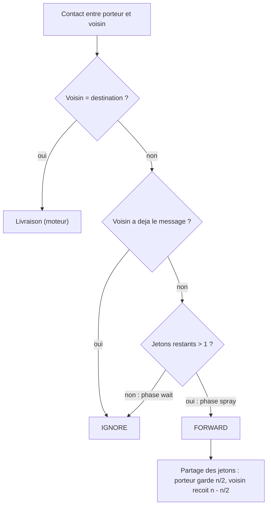

# `spray_wait` — Spray and Wait binaire

Fichier : `src/festival_ble_sim/routing/spray_and_wait.py`
Spec : `docs/algorithmes/specs/SPRAY-WAIT.md`

## Principe

Chaque message nait avec `L` jetons (`--spray-initial-copies`, defaut 8).
Lors d'un forward, le porteur garde la moitie des jetons et donne l'autre
au voisin (`on_forward`). Avec un seul jeton, le porteur passe en phase
*wait* : il ne transmet plus qu'a la destination elle-meme.

## Diagramme

Decision prise pour chaque message du porteur a chaque contact :

## Forces

- Overhead borne et previsible : au plus `L` copies par message.
- Consommation d'energie bien plus faible que l'inondation.
- Aucun etat global, un seul parametre, comportement facile a raisonner.

## Faiblesses

- Aveugle : distribue ses copies au premier venu, sans savoir qui a une
  chance de croiser la destination.
- Phase wait potentiellement longue : latence elevee.
- `L` fixe, independant de la densite : trop peu en zone clairsemee, trop
  en zone dense.
- N'exploite pas les bornes.
