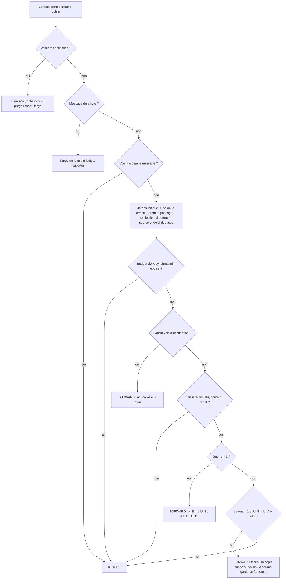

# `tide` — TIDE (Tokens, Islands, Density, Energy)

Fichier : `src/festival_ble_sim/routing/tide.py`
Spec : `NICE — Algorithmes de routage candidats et protocole de comparaison.md`

## Principe

Version reduite au niveau reseau (pas de crypto, ID ephemeres, digests,
cycle de scan/annonce, quota par emetteur ni reputation ; voir l'en-tete
du fichier) :
- utilite `U_X(d) = e_X [w P_X(d) + (1-w) exp(-dt_X(d)/tau)]`, avec
  PRoPHET (transitivite desactivee par defaut, trop couteuse a 4000
  noeuds) et fraicheur de la derniere rencontre directe ;
- jetons initiaux selon la densite locale (entre `l_min=2` et `l_max=16`,
  regle sur 4 seeds, cf. `archives/2026-10-02_*_tune_tide_combo*`), partages au prorata de
  l'utilite, puis copie unique qui avance si `U_B > U_A + delta` ;
- ilots : tout voisin qui voit la destination recoit une copie (0 jeton) ;
- election des relais toutes les 5 min selon densite et energie ; les
  membres ne portent pas les messages des autres, les feuilles (< 15 %)
  jamais ; repli relais apres 30 s sans relais visible ;
- au plus K pairs synchronises par minute et par porteur ;
- la source garde une copie fantome et reinjecte des jetons a 3, 6 et
  20 min sans ACK ;
- purge reseau-large a la livraison, eviction : acquittes, expires, en
  retard, copies a 1 jeton de faible utilite, jamais les messages propres.

## Diagramme

Decision prise pour chaque message du porteur a chaque contact :

## Forces

- Livraison immediate dans les ilots denses (foule devant une scene).
- Budget de copies borne et oriente par l'utilite plutot qu'une division
  aveugle par moitie.
- L'election limite le nombre de telephones qui portent le trafic des
  autres en foule dense, et epargne ceux en batterie faible.
- La reinjection rattrape les messages dont les copies se sont perdues.

## Faiblesses

- Beaucoup de parametres, calibration delicate.
- Vues exactes de l'instance partagee (2 sauts, densite, purge
  instantanee) optimistes par rapport aux annonces BLE reelles.
- Le moteur ne modelise ni l'energie de decouverte ni le cout des
  connexions : les gains attendus des digests et du cycle de scan ne
  sont pas mesurables ici.
- Election aleatoire : un membre sans relais a portee attend 30 s avant de
  relayer lui-meme.
