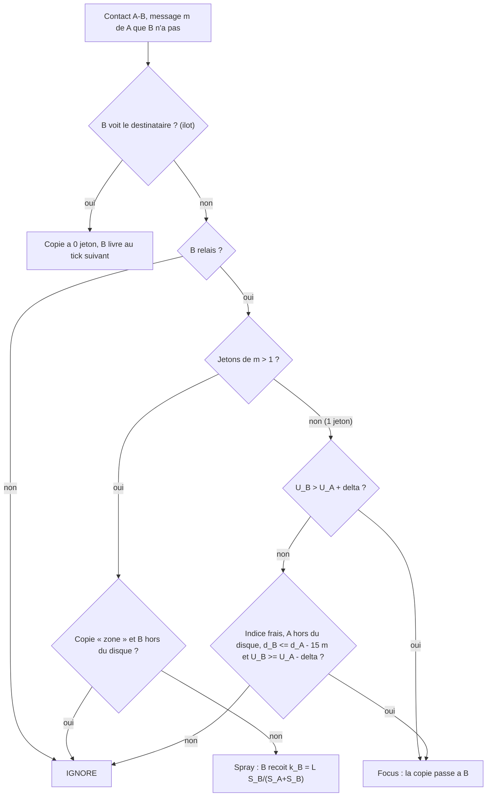

# `tide_g` — TIDE-G (TIDE guide par la position du destinataire)

Fichier : `src/festival_ble_sim/routing/tide_g.py`
Spec : `docs/TIDE-G.md`

## Principe

Sous-classe de `TideRouting` : tout TIDE est conserve (ilots, election,
quota de synchros, reinjection, ACK, eviction). S'y ajoute un indice, la
derniere position du destinataire connue de la source
(`message.dst_position`, que seul le destinataire a fournie dans son
dernier message livre a la source) :
- indice utilisable s'il a moins de `hint_max_age_s` (15 min), arrondi a
  une case de `hint_cell_m` (25 m) ; disque d'incertitude
  `r(h) = r0 + v h` (30 m + 0,3 m/s) et confiance `kappa = exp(-h/600)` ;
- fix GPS toutes les 30 s pour les relais elus et les porteurs d'un message
  a indice, facture `gps_current_ma` (10 mA) ; un fix de plus de 60 s ne
  compte pas, les bornes ont leur position exacte gratuitement ;
- score `S = min(1, max(U, e kappa g))` avec
  `g = 1 / (1 + max(0, d - r)/100)` : jamais en dessous de TIDE ;
- recherche locale : une copie a 1 jeton chez un noeud dans le disque passe
  une fois a 3 jetons « zone », qui ne vont qu'a des relais du disque ;
- la source remplace l'indice de sa propre copie si elle a recu une
  position plus recente.

Necessite le modele de reponses (`--reply-probability`), sinon presque
aucun message n'a d'indice.

## Diagramme

## Forces

- Les conversations (reponses rapides) profitent d'une position souvent
  encore exacte : la plupart des festivaliers sont a l'arret.
- Le `max` avec l'utilite TIDE et la condition `U_B >= U_A - delta`
  empechent toute regression ou aller-retour par rapport a TIDE.
- Relais seuls a enregistrer une position : la leur, jamais celle des
  autres.

## Faiblesses

- Aucun gain sur les premiers messages d'une conversation (pas d'indice).
- Cout GPS (10 mA) a mesurer sur appareils ; il peut doubler la
  consommation par noeud.
- Bruit GPS en foule (5 m dans le simulateur) probablement optimiste.
