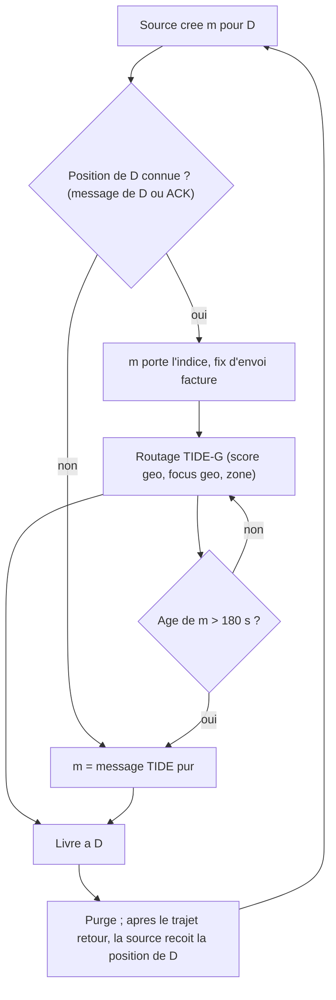

# `tide_g2` — TIDE-G2 (TIDE-G + position dans l'ACK)

Fichier : `src/festival_ble_sim/routing/tide_g.py` (preset `TIDE_G2_KWARGS`)
Spec : `docs/algorithmes/specs/TIDE-G2.md`

## Principe

`TideGRouting` avec trois interrupteurs actives ; tout le reste est TIDE-G
(voir `tide_g.md`), et sans indice utilisable on retombe exactement sur
TIDE :
- `ack_hint` : a la livraison, l'ACK rapporte a la source la position du
  destinataire, apres un delai egal au trajet aller
  (`ack_hint_delay_factor`). Elle est ecrite dans `known_positions` de la
  source, donc le moteur la met dans `dst_position` du message suivant.
  Un indice n'exige plus que le destinataire ait *ecrit* a la source ;
- `geo_giveup_s` (180 s) : passe cet age, le message ignore son indice et
  redevient un message TIDE pur (plus de copies « zone » enfermees dans
  un disque que le destinataire a quitte) ;
- `charge_message_fixes` : les fixes ponctuels a l'envoi et a l'ACK sont
  factures (5 s de GPS), sauf si le fix periodique a moins de 60 s.

Deux ajouts restent des ablations hors preset : `hint_scaled_tokens`
(premier spray reduit quand l'indice est frais, rejete : perd des
livraisons) et `relay_hint_merge` (fusion d'indices dans le buffer d'un
relais, rejete : rien gagne, entorse a la vie privee). `hint_stats`
ajoute `hinted_by_ack`, `delivered_after_giveup`, `message_fixes`.

A lancer avec `--mobility poi --reply-probability 0.5
--followup-probability 0.5` : sans reponses ni rafales, presque aucun
message n'a d'indice.

## Diagramme

## Forces

- Multiplie les indices quand la conversation n'est pas alternee : avec
  rafales et sans reponses, 5 % -> 14 % des messages ont un indice.
- L'abandon a 180 s baisse un peu la surcharge sans couper de livraisons
  (20 a 30 % des messages a indice sont livres apres l'abandon).
- Fixes ponctuels quasi gratuits a densite moderee : la plupart des noeuds
  ont deja un fix periodique frais.
- La position dans l'ACK est chiffree pour la source et couverte par la
  signature : aucun relais ne la lit (cote appli).

## Faiblesses

- Plus d'indices ne donne pas plus de livraisons : a 400 festivaliers,
  aucun ecart avec TIDE-G au-dela du bruit (+/- 1 a 2 points sur 3
  graines). Le goulot est la connectivite, pas la localisation.
- Herite du cout GPS de TIDE-G : energie x2 a x2,3 par rapport a TIDE pour
  1 a 2 points de livraison.
- Gain dependant de taux de reponses et de relances inconnus en festival.
- Purge par ACK instantanee dans le moteur ; seule la position est
  retardee.
- Pas encore mesure a la densite de reference (~11 400 personnes/km2).
